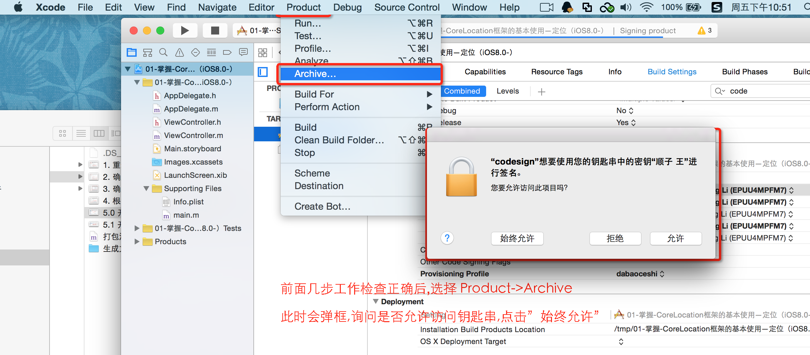
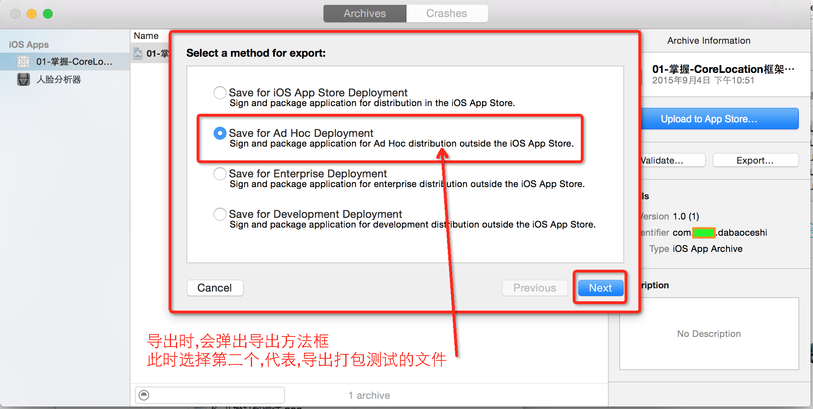

##	 1.证书生成/描述文件的配置/证书安装

#图：

####	1. 重新生成打包测试证书(确定哪台机器可以进行打包测试)
.png)
####	2. 确定哪个APP可以进行打包测试

####	3. 确定哪些设备可以安装APP测试包

####	4. 根据前三项生成描述文件

##	2.打包测试

####	5.0 开始打包测试-项目BundleID

####	5.1 开始打包测试-检查工作证书和描述文件

####	6. 开始打包测试

####	7. 打包成功,导出

####	8. 打包成功,选择导出方法

####	9. 选择开发团队,用作描述

####	10. 选择APP设备支持

####	11. 打包概述

#文字：
###	测试打包

-	1.登录apple的开发者主页:developer.apple.com

-	2.选择Ad Hoc生成一个ios_distribution.cer: 让电脑具备打包程序的能力

-	3.新建一个App ID : 确定哪个APP可以被打包测试

-	4.利用用户设备的UDID注册设备(确定哪些设备可以被打包测试)

-	5.选择Ad Hoc利用ios_distribution.cer + 设备UDID + App ID --> 描述文件
	(描述文件的作用:
	-	1> 能知道在哪台电脑上, 为哪台设备打包哪个程序
 	-	2> 哪台设备需要测试哪个程序)

-	6.最终产生了3个文件
	-	1> CertificateSigningRequest.certSigningRequest
		* 包含了电脑的信息
		* 发送给苹果服务器, 苹果服务器根据文件信息来生成一个电脑证书
		* 生成的证书就可以让对应的电脑具备某个特殊的能力

	-	2> ios_distribution.cer
		* 打包证书
		* 安装这个证书后, 电脑就具备打包程序的能力

	-	3> nj_iphone6_news.mobileprovision
		* 里面包含了3个信息:ios_distribution.cer + 设备UDID + App ID

-	7.安装证书和描述文件
	-	1> ios_distribution.cer
	-	2> nj_iphone6_news.mobileprovision

-	8.项目Scheme右边的设备选择iOS Device

-	9.点击Xcode的菜单
	-	Product --> Archive --> Distribute --> ....Ad Hoc... --> 选择对应的描述文件

-	10.生成一个ipa文件,发给测试人员和客户
	* ipa本质是zip
	* android的安装包是APK格式,本质也是zip