###	GIT的简单介绍

####	一.GIT的简介

1.什么是git

	一款开源的分布式版本控制工具而svn是集中式版本控制器在世界上所有的分布式版本控制工具中，
	git是最快、最简单、最流行的,使用的人也是最多的
	
2.git的起源

	作者是Linux之父：Linus Benedict Torvalds,当初开发git仅仅是为了辅助Linux内核的开发（管理源代码）

3.git的现状

	在国外已经非常普及，国内并未普及（在慢慢普及)	越来越多的开源项目已经转移到git,git的学习也异常重要

4.git的logo

####	二.对于其他版本控制工具的介绍二.对于其他版本控制工具的介绍

1.CVS

	最早的开源、免费的集中式版本控制工具
	自身设计有问题，会造成提交文件不完整，版本库莫名其妙损坏的情况,当时仅有CVS,所以程序员尽量去避免
	这样的问题的出现(文件不完整多提交几次,版本库损坏多备份几份)
    
2.SVN

	修正了CVS的一些稳定性问题，是目前用得最多的集中式版本库控制工具,普及率达到70%-90%
    
3.ClearCase

	收费的集中式版本控制工具，安装比Windows还大，运行比蜗牛还慢
	能用ClearCase的一般是世界500强，他们有个共同的特点是财大气粗或者人傻钱多,一般国内没有人用,
	一般使用SVN,免费还好用
    
4.VSS

	微软的集中式版本控制工具，集成在Visual Studio中
	Visual Studio:开发C#,windowsphone,windows的软件

####	三.集中式与分布式版本控制器的区别
1.集中式

	ComputerA想要服务器最新的代码直接通过checkout向服务器下载
	ComputerA在本地修改代码后,直接提交到服务器
	ComputerB想要服务器最新的代码直接通过checkout向服务器下载
	ComputerB在本地修改代码后,直接提交到服务器
	所有的内容统一交给服务器来进行管理

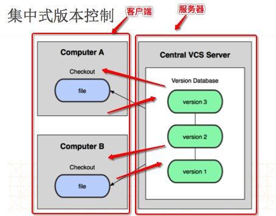

2.分布式

	服务器本地有个代码仓库,从服务器更新代码,上传代码
	ComputerA想要服务器最新的代码由本地代码仓库将服务器的代码下载下来,再通过本地代码仓库的项目下载到ComputerA
	ComputerA在本地修改完代码后先提交到本地的代码仓库,再由本地的代码仓库提交到服务器
	ComputerB操作与ComputerA相似
	代码的提交与更新首先会通过本地代码仓库,本地代码仓库再通过服务器,并不是直接交给服务器来进行管理

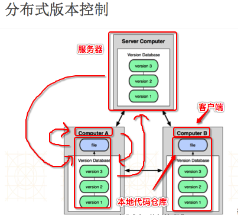

####	四.集中式与分布式的简单对比

1.速度

	在很多情况下，git的速度远远比SVN快,git提交可以先提交到本地,网络畅通的时候
	再统一提交到服务器,而SVN的改动必须提交到服务器

2.结构

	SVN是集中式管理，git是分布式管理(重要)
    
3.其他

	SVN使用分支比较笨拙，需要先从tags中将代码拷贝过来,修改后备份到分支,分支再与主干的项目合并
	git可以轻松拥有无限个分支,轻松的在各个分支随意切换
	SVN必须联网才能正常工作，git支持本地版本控制工作(git可以先提交到本地版本库)
	旧版本的SVN会在每一个目录置放一个.svn(目前svn1.7的只有一个.svn)，git只会在根目录拥有一个.git
  
####	五.SVN与git的工作流程

1.SVN的工作流程:讲解SVN的时候讲过,这里不再阐述

2.git的工作流程

	这幅图以类区分总共有两类角色,一类共享版本库(可以称之为服务器),一类是开发人员
	开发人员A想要共享版本库的代码,通过clone命令向服务器下载,将服务器完整的代码下载到本地版本库中,之后本地版本库将代码自动下载到本地
	开发人员A在本地修改后,提交代码,通过commit命令先提交到本地版本库,之后通过push命令将本地版本库的代码提交到共享版本库
	开发人员B想要共享版本库的代码,通过clone命令向服务器下载,将服务器完整的代码下载到本地版本库中,之后本地版本库将代码自动下载到本地
	开发人员B在本地修改后,提交代码,通过commit命令先提交到本地版本库,之后通过push命令将本地版本库的代码提交到共享版本库
	开发人员A想要服务器最新的代码,通过pull命令现将服务器最新的代码更新到本地版本库,之后本地版本库将代码自动更新到本地

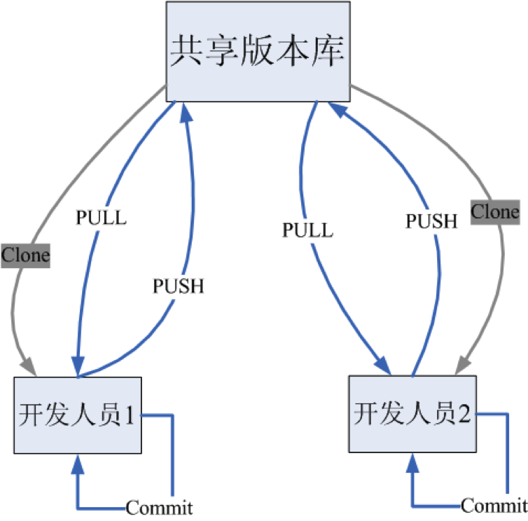

3.分布式和集中式的最大区别在于

	在分布式下开发者可以本地提交,每个开发者机器上都有一个服务器的数据库
    
####	六.如何使用git

1.命令行:常用的命令简单且不多,直接使用命令行就行

2.图形化界面工具

	SourceTree GitHub

`SourceTree GitHub 3.xcode xcode对git的集成非常非常好,一般情况下,直接使用xcode就行`

###	1.初始化GIT仓库

####	一.前提准备工作

	1.创建一个GIT文件夹代表演示git的所有操作
	2.在GIT文件夹下创建命令行的演练,用于演练git的命令行
	3.打开终端

二.初始化git仓库

1.进入到命令行的演练文件夹,初始化一个空的代码仓库

-	git init

2.给git配置一个用户名和邮箱

	git config user.name "XY":配置用户名
	git config user.email "XY@163.com":配置邮箱
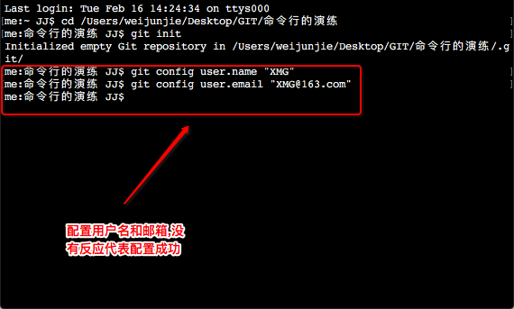

3.查看配置的用户名和邮箱

	.git->config(使用文本编辑打开)

4.给git配置全局的用户名和邮箱(只要创建了git就必须配置用户名和邮箱,配置全局的后,当该文件没有用户名和邮箱则会使用全局的)

	git config --global user.name"XY":配置全局用户名
	git config --global user.email"XY":配置全局邮箱
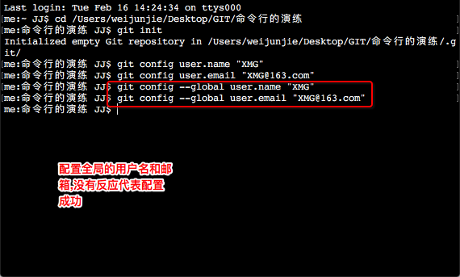

5.查看配置的全局的用户名和邮箱

	前往->个人->.gitconfif(使用文本编辑打开)

####	三.初始化项目

1.在工作目录(.git的同级目录),创建main.m

	touch main.m

2.查看文件状态

	git status
      红色:新创建的文件或者修改的文件没有被添加到暂缓区

3.将main.m添加到暂缓区

	git add main.m
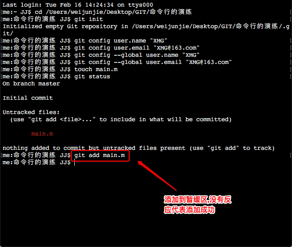

4.查看加入到暂缓区后的文件状态
	
	git status
		绿色:文件在暂缓区,但是没有添加到本地仓库中
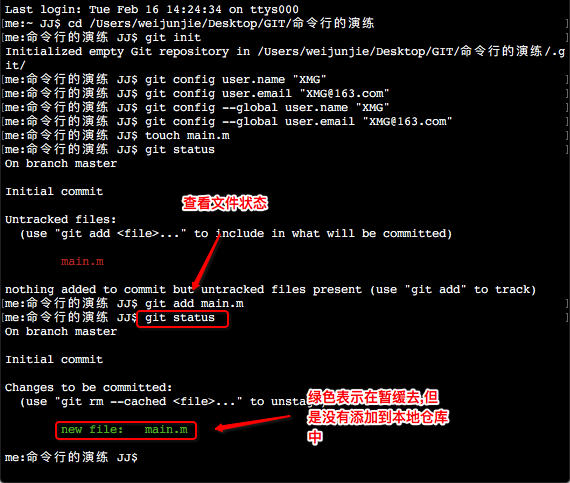

5.将mian.m提交到本地代码仓库中

	git commit -m "初始化项目" main.m

6.查看提交到本地代码仓库后的状态

	git status

7.打开main.m写一些代码

	open main.m
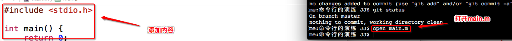

8.查看文件状态(依旧为红色,只要是新建的文件或者是修改的文件都是红色,表示没有被添加到暂缓区)

	git status

9.将mian添加到缓存区

	git add main.m
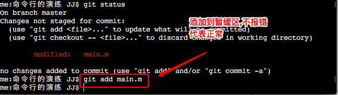

11.查看添加后的状态(可以进行提交)
	
	git status

12.将修改的main.m提交到本地代码仓库中

	git commit -m "修改了main.m中的内容"
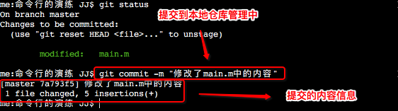

13.查看提交后的状态
	
	git status

####	四.总结

	初始化本地的代码仓库之后必须指定用户名和邮箱,否则无法提交
	添加文件以及修改文件都要重新 git add 一次,仅仅是在使用命令行进行添加文件的时候才需要,如果是用xcode来创建的文件,xcode会默认执行git add 操作,不需要再进行git add操作

####	2.GIT工作原理

一.核心的概念

	1.工作区(Working Directory):
	git的工作目录,.git的同级目录包括同级目录下的子目录,不包括.git
   
	2.版本库(Repository)
		.git目录,用于存储记录版本信息
		1.暂缓区(stage)
		2.分支(master):git会默认自动创建的一个分支,为master分支,可以认为是SVN中的主干
		3.HEAD指针,用于指向当前分支,默认指向master分支,可以通过HEAD指针来回切换分支
   
####	二.git add 和git commit 原理

	1.git add :将修改的文件或者添加的文件添加到暂缓区
	2.git commit:把暂缓区的所有内容提交到当前分支(HEAD指针指向的分支),如果该文件不在暂缓区则不会提交

####	三.工作原理介绍

	1.总步骤
		通过git add 命令将工作区的内容提交到版本库的缓存区
		通过git commit 命令将缓存区的所有内容提交到当前分支
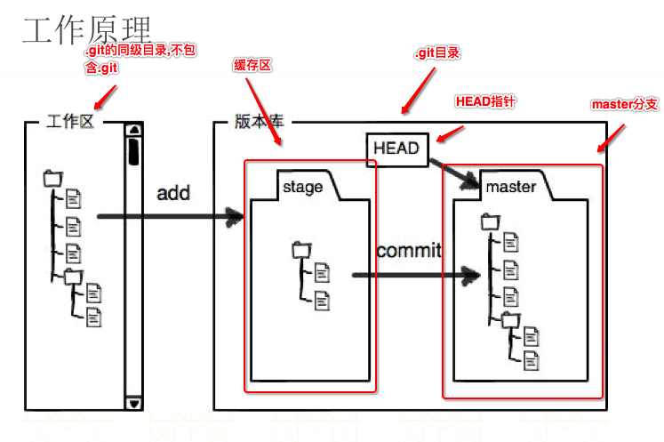

	2.工作区提交到暂缓区

	3.暂缓区提交到当前分支,暂缓区内容清空
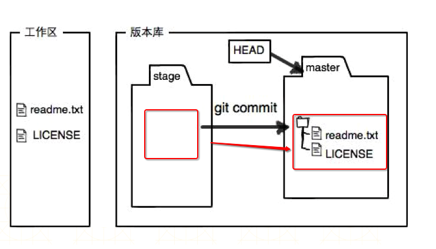

####	四.总结
	1.svn开发工作在主干进行,git开发工作在分支中进行
	2.通过add命令可以将工作目录没有被添加到暂缓区的文件添加到暂缓区
	3.通过commit命令将暂缓区的所有内容上传到当前分支,提交成功后清空暂缓区内容

###	3.GIT命令行的其它用法

####	一.给命令起别名

	1."给status"起别名为"st"
		git config alias.st "status"

	2.来到.git->.config查看起的别名

	3.创建person类
		touch person.h person.m

	4.通过刚起的别名"git st"来查看文件状态
		git st

	5.将person类添加到暂缓区
		git add .:.相当于*,将工作目录下所有没有被添加到暂缓区的文件添加到暂缓区
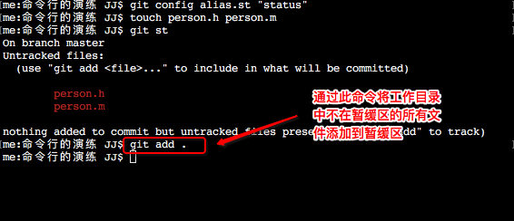

	6.查看添加后的状态
		git st
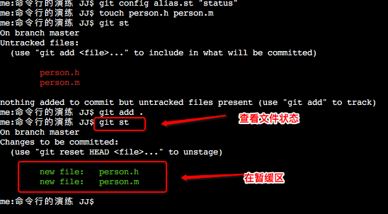

	7.给"commit -m"起别名为"ci"
		git config alias.ci "commit -m"

	8.来到.git->.config查看起的别名
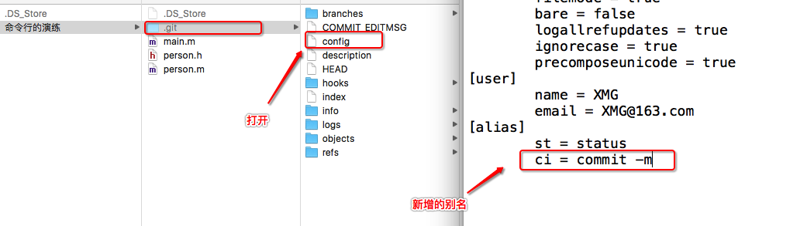

	9.通过刚起的别名"git ci"将暂缓区的person类提交到本地代码仓库
		git ci "添加了person类":后面不跟文件名,则会将暂缓区内所有的内容提交到本地代码仓库

	10.配置全局的别名
		git config --global alias.st "status"
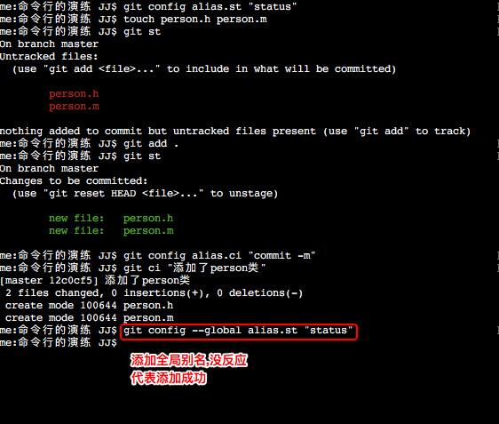

	11.查看全局的别名(前往->个人->.gitconfig)
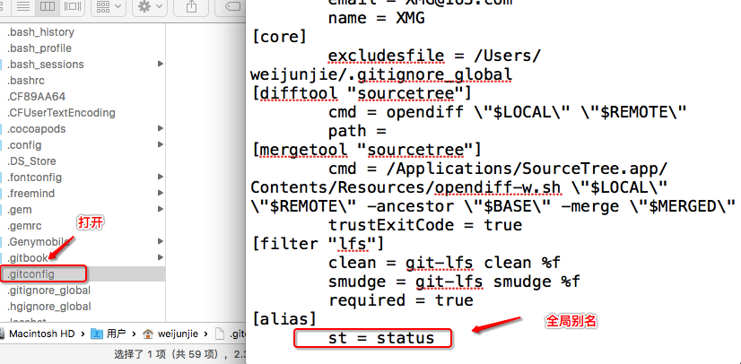

####	二.git删除文件
	1.将person.m删除
		git rm person.m

	2.查看文件状态(在暂存区里面)
		git st
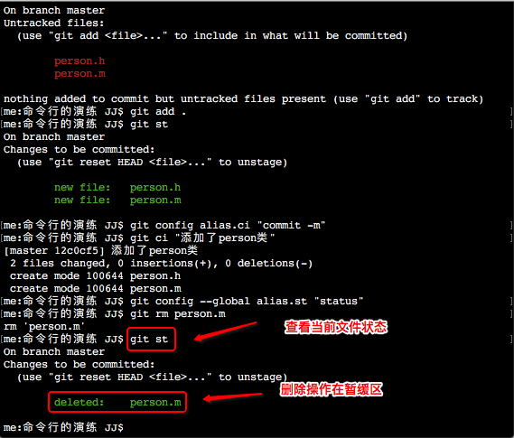

	3.将删除操作提交到本地代码仓库
		git ci "删除了person.m"

	4.查看文件状态
		git st (暂缓区没有任何内容需要提交)

####	三.查看版本号
	1.第一种查看版本号方式,仅能查看当前版本以及以上的版本
		git log
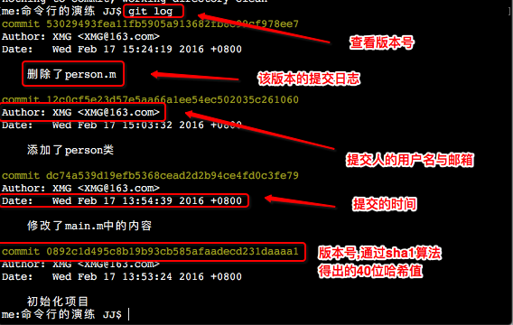

	2.第二种查看版本号方式,可以查看所有的修改记录(版本绘图)
		git reflog

	3.给查看版本起全局别名
		git config --global alias.lg "log --color --graph --pretty=format:'%Cred%h%Creset -%C(yellow)%d%Creset %s %Cgreen(%cr) %C(bold blue)<%an>%Creset' --abbrev-commit”
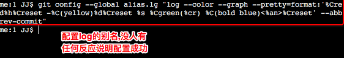

	4.查看起的别名(前往->个人->.gitconfig)

	5.使用别名查看log信息
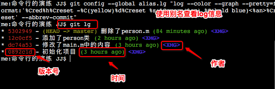

####	四.版本回退
	1.打开person.h,添加代码
		open person.h

	2.在没有提交的情况下进行版本回退
		git reset --hard HEAD:强制回退到当前版本,还未提交的一个版本
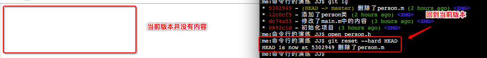

	3.回退到上一个版本
		git reset --hard HEAD^
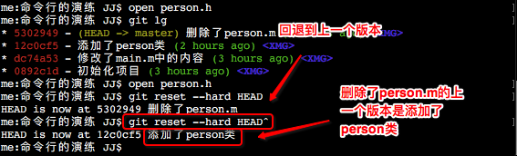

	4.回退到上上个版本
		git reset --hard HEAD^^
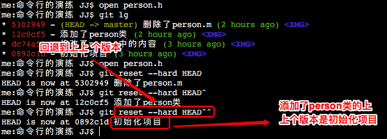

	5.回退到指定回退到某个版本
		git reset --hard 版本号(至少前5位)

	6.回退到前几个版本
		git reset --hard~1
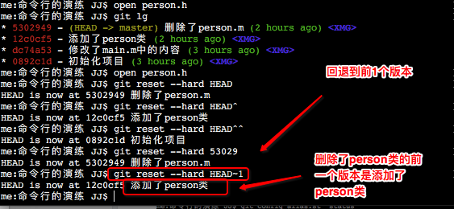

####	五.使用reflog查看日志
	git reflog
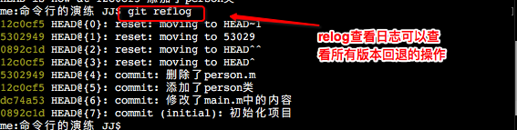

####	六.总结
	1.起别名:当前版本库别名,与全局别名(只需要起一次,下次创建仓库后就不用起别名了)
	2.删除文件:git rm 文件名,删除后保存在暂缓区,需要提交到代码仓库
	3.查看版本号
		git log:查看当期与当前以上的操作
		git reflog:查看版本包含回退的操作
	4.版本回退:回退到之前提交过的版本
	
###	4.初始化共享版本库和初始化项目

####	一.作为共享版版本库
	1.搭建git服务器
    	真实的git服务器的搭建需要使用Linux来进行搭建,搭建难度大且繁琐
	2.将代码托管Github:必须开源,不想开源需要交钱
	3.或者OSChina:免费,推荐国内速度快
	4.一个U盘可以为共享版本库
	5.一个文件可以作为共享版本库

####	二.文件作为共享版本库
	1.在GIT目录下创建一个Server的文件夹来作为共享版本库
	2.打开终端,使用命令行初始化一个共享版本库
		git init --bare

	3.在GIT目录创建一个开发人员文件夹,并在里面创建一个经理的文件夹代表经理的电脑

####	三.项目经理初始化项目

	1.将服务器完整的内容下载到本地
	git clone 服务器地址
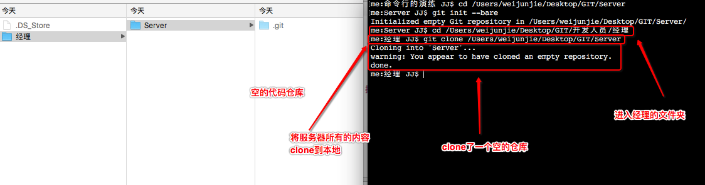

	2.添加忽略文件".gitignore",使用git需要忽略的一些文件
	touch .gitignore

	4.github中拷贝需要忽略的内容(github搜索.gitignore->找星最多的,点进去,找到object-c,打开复制)

		1.进入github(https://github.com),搜索.gitignore,回车
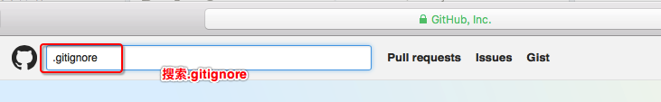

		2.选择星星最多的项目
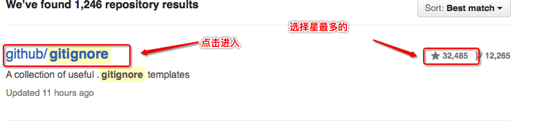

		3.找到Object-C点进去

		4.复制所有内容到.gitignore文件中

	5.将.gitignore添加到缓存区
		git add .gitignore

	6.将.gitignore提交到服务器
		git commit -m "添加了需要忽略的文件"
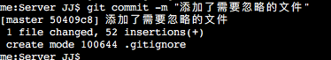

	7.使用xcode的初始化weibo项目放到经理的工作目录中
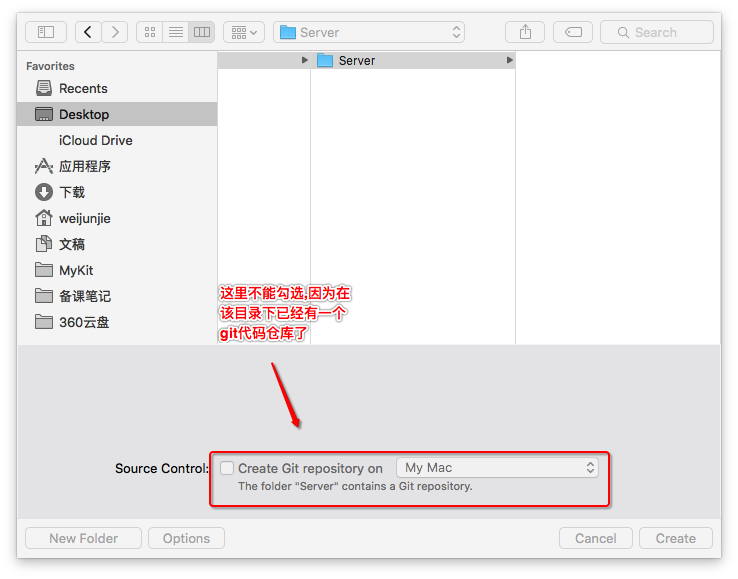

	8.打开项目weibo项目,所有文件已经在暂缓区了
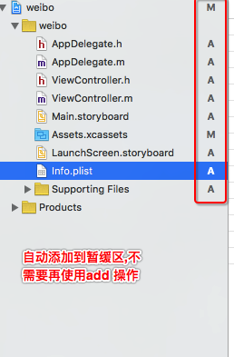

	9.使用xcode提交到本地版本库(Source control -> commit),提交仅仅是提交到了本地版本库
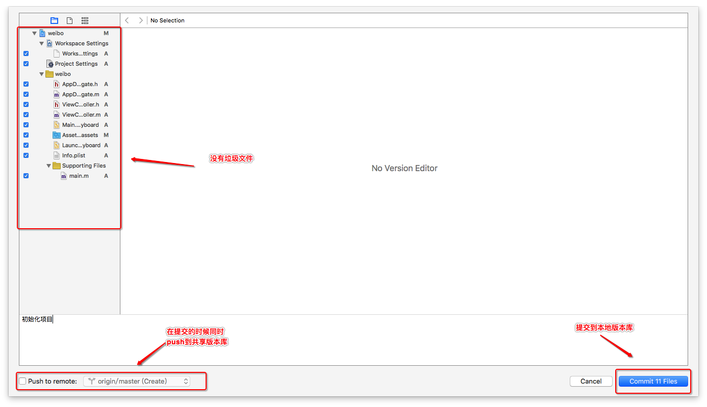

	10.使用xcode上传到共享版本库(Source control -> push)
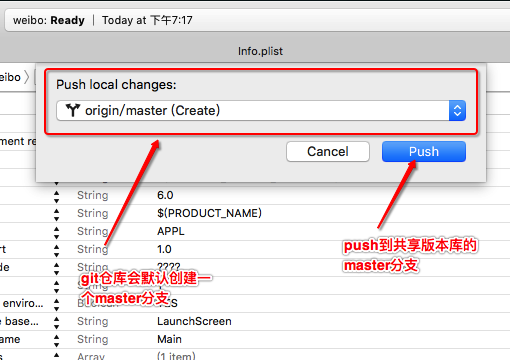

####	四.张三加入开发(验证项目经理的push操作是否成功在共享版本库中)
	开发人员目录下创建张三文件夹,并将共享版本库的代码下载到本地

	五.总结
	1.文件作为共享版本库首先要创建个共享版本库,之后将共享版本库下载到本地就有了个.git仓库,在初始化项目之前先创建忽略文件,并从github上复制需要忽略的内容在文件中
	2.新增命令,git clone 共享版本库地址:下载共享版本库完整的内容到本地
	3.初始化完项目commit提交到本地版本库,push提交到共享版本库
	
	
###	5.GIT共享版本库多人开发

####	一.多人开发
	1.项目经理开发
    viewcontroller删除点代码后提交并push到共享版本库(source control -> commit)
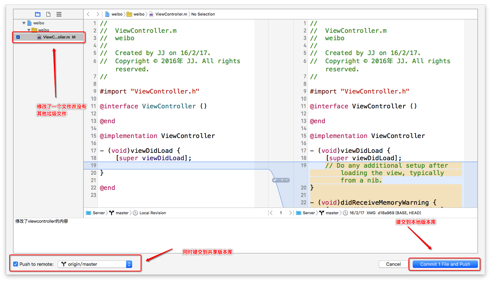

	2.张三开发
    	1.从共享版本库将最新的代码更新到本地(Source control -> pull)
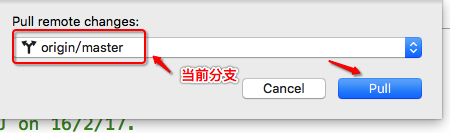

		2.打印"好好工作"提交并push到共享版本库

	3.项目经理开发
    	1.从共享版本库将最新的代码更新到本地(Source control -> pull)
    	2.创建person类提交并push到共享版本库

	4.张三开发
    	1.从共享版本库将最新的代码更新到本地(Source control -> pull)
    	2.打印"张三牛x"提交并push到共享版本库

	5.项目经理开发
    	1.在张三打印相同的那行代码打印"张三傻x",commit提交到本地版本库
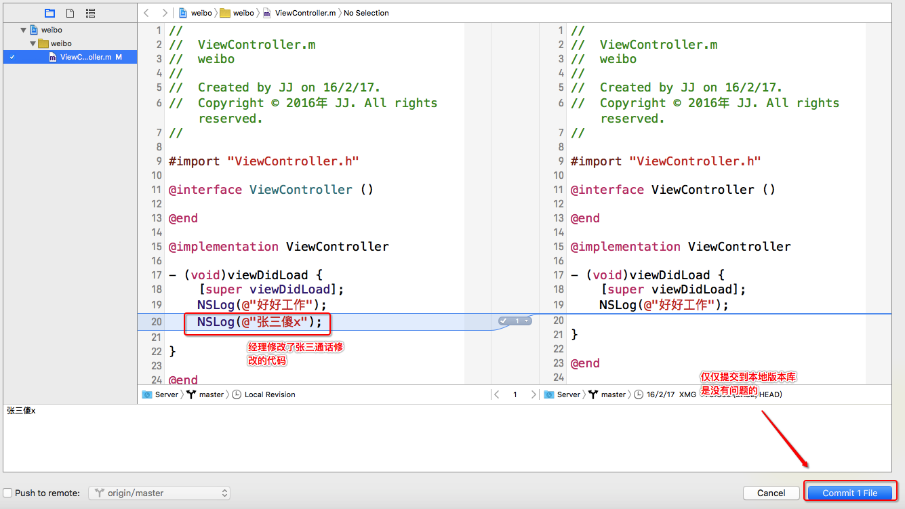

    	2.点击push到共享版本库,报错过期
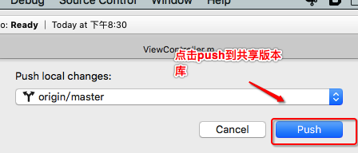

    	3.点击pull更新代码到本地,发生冲突

    	4.解决冲突,两者都保留
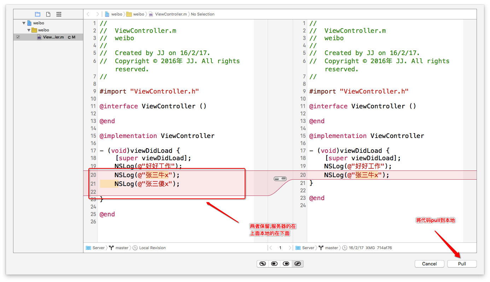

    	5.提交本地的修改commit并push到共享版本库

		6.张三开发
    	从共享版本库将最新的代码更新到本地(Source control -> pull)
    	
####	二.使用静态库

	1.将静态库拖入项目中,不识别.h文件也不识别.a文件,可以说不识别RegexLib文件夹的所有内容(仅仅是目前xcode对git支持的bug,以前并没有此情况,期待后期修复)
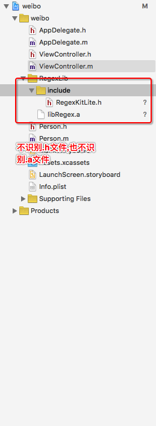

	2.解决方案(一):
    	通过命令行,将RegexLib文件夹的所有内容添加到暂缓区
    	git add .
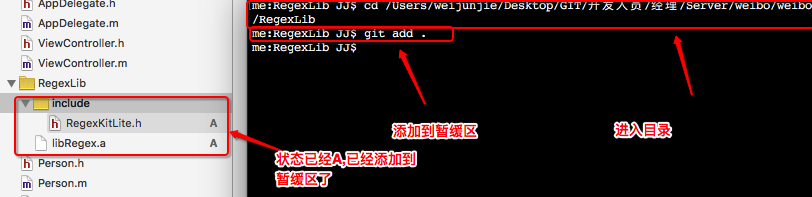

	3.解决方案(二):
    	1.先创建真实文件夹拖入到项目中
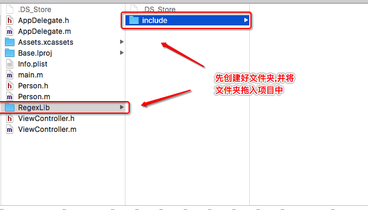

    	2.静态库和代码拖入到项目中

	4.提交添加的静态库并push到共享版本库中
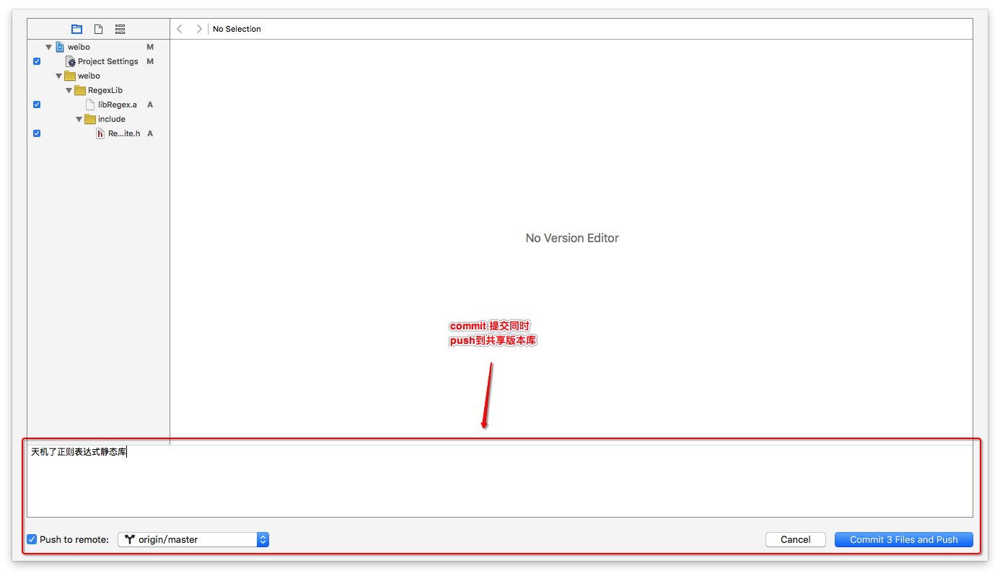

####	二.总结

	1.使用git先commit提交到本地版本库,再push到共享版本库
	2.更新共享版本库的最新代码使用pull
	3.先pull后再修改代码可以有效的避免冲突
	4.保证只有一个人在修改storyboard的内容
	5.在xcode中使用git解决冲突与svn使用解决冲突类似
	6.静态库拖入后不识别两种解决方案
	
###	6.GIT版本备份

####	一.多人开发1.0版本
	1.经理打印"经理开发1.0版本"代表正在开发1.0版本,之后commit提交并push到共享版本库中(Source Control -> commit)

	2.张三将经理push的代码从共享版本库pull到本地(Source Control -> pull)
	3.张三打印"张三完整1.0版本的开发"代表1.0版本已经开发完毕,之后commit提交并push到共享版本库中(Source Control -> commit)

	4.经理将张三push的代码从共享版本库pull到本地(Source Control -> pull)
	
####	二.经理对1.0版本进行备份
	1.来到经理的weibo工作目录通过终端备份标签名为"weibo1.0",注释为"这个是1.0版本"
		git tag -a weibo1.0 -m "这个是1.0版本" : 给某个版本打上标签

	2.查看标签
		git tag : 查看所有的标签
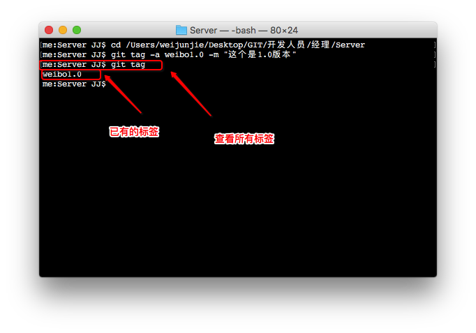

	3.将打的标签push到服务器
		git push origin weibo1.0 : 将weibo1.0push到默认的代码仓库

####	三.多人开发2.0版本
	1.经理打印"开始进行2.0版本的开发",代表正在开发2.0版本.之后commit提交并push到共享版本库中(Source Control -> commit)
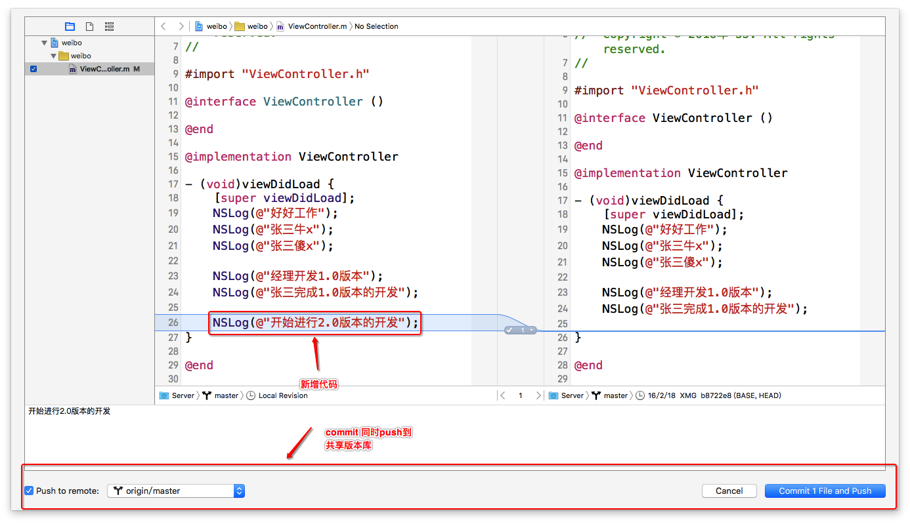

	2.张三将经理push的代码从共享版本库pull到本地(Source Control -> pull)

####	四.1.0版本有bug,修复bug
	1.经理目录下新建文件夹"weibo1.0fixbug",并将服务器所有的内容clone到本地
		git clone 服务器地址
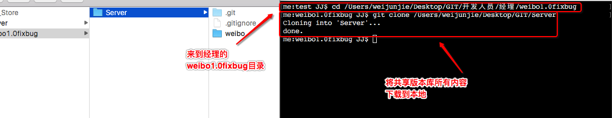

	2.将当前的代码转为打上标签的代码
		git checkout weibo1.0
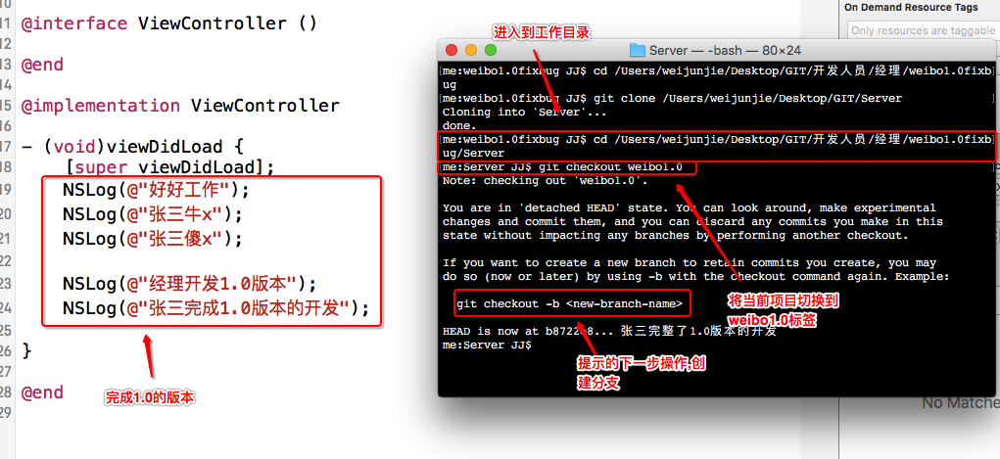

	4.创建分支名为weibo1.1fixbug,并切换到这个分支
		git checkout -b weibo1.1fixbug
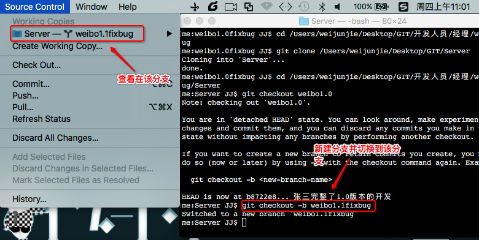

	5.项目经理写个方法"fixBug"代表修复了1.0的bug,并将修复完bug的版本提交到服务器(Source Control -> Commit)
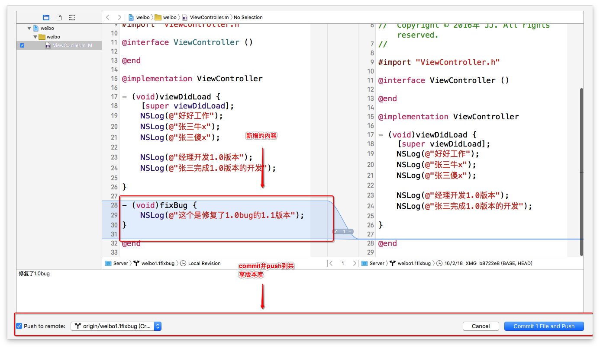

	6.给修复好的版本打上tag(注意:标签名不能重复,也不能和分支名重复)
		git tag -a weibo1.1 -m "这是修复了1.0版本的1.1版本"

	7.查看所有标签
		git tag

	8.将打上标签的1.1版本push到服务器
		git push origin weibo1.1

####	五.将1.1版本合并到正在开发的2.0版本,来到正在开发的2.0项目
	1.(Source Control)点击pull,从weibo1.0fixbug里面将代码pull到本地代码仓库

	2.将本地代码仓库的内容push到master分支(Source Control -> push->master)
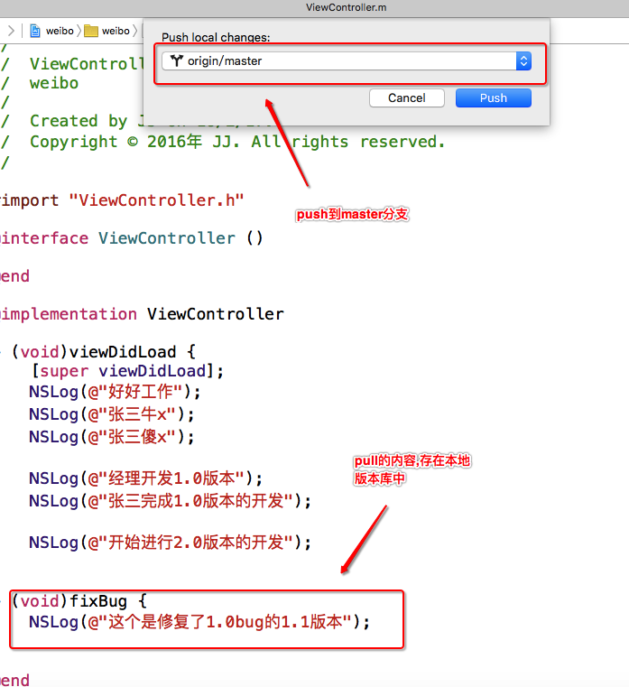

	3.张三从master分支pull最新的代码(Source Control -> pull->master)

####	六.删除分支
	1.查看所有分支
		git branch -r

	2.删除weibo1.0fixbug分支,需要全路径
		git branch -r -d origin/weibo1.1fixbug


	3.删除远程的分支
		git push origin --delete 分支名:删除服务器的分支

####	七.总结
	1.开发流程:
    	1.开发1.0版本
    	2.1.0版本开发完成,对1.0版本打上标签,并将标签push到共享版本库
    	3.开始开发2.0版本
    	4.突然1.0版本有bug
    	5.新建文件夹从共享版本库把所有代码下载到本地
    	6.切换到打上标签的代码
    	7.创建分支并切换到该分支
    	8.在分支中修复bug并提交到共享版本库
    	9.将修复完的代码从分支合并到正在开发的2.0版本的分支
    	10.继续2.0版本的开发
	2.分支和标签名不能重复
		git push origin 分支名 :提交分支到共享版本库
		
		
###	7.新人服务器的搭建

####	一.创建新人服务器
	1.在Server同级目录下创建一个"newWeibo"文件夹,并初始化共享版本库
		git init --bare


	2.打开经理的微博项目,之后配置远程服务器,->Source Control ->master->Configure Server


	3.点击加号添加远程服务器


	4.填写远程服务器的地址与名称


	5.添加后的状态


	6.将weibo项目push到新建的远程服务器


####	二.李四获取源代码
	开发人员创建李四的文件夹,clone新人服务器的所有东西到李四文件夹
		git clone 新人服务器地址


####	三.总结
	搭建新人服务器的主要目的是为了保证服务器的代码不会受到新人随意修改

###	8.创建Github代码仓库和HTTPs验证

####	一.前提准备
	1.在GIT中创建一个Github文件夹演练的github
	
####	二.登陆github网站git hub

 

####	三.创建远程仓库
	1.点击+ ->New repository


	2.创建远程代码仓库


	3.创建后会来到此界面,将https的url复制下来


####	四.在Xcode中添加远程仓库
	1.点击Xcode的偏好设置


	2.点击添加仓库


	3.填写服务器地址,源代码管理类型,认证方式以及帐号密码


4.看到以下界面说明认证成功


####	五.初始化项目
	1.点击Source Control -> checkout


	2.选择刚刚创建远程仓库


	3.下载到指定位置


	4.查看下载的内容


	5.创建项目放到meituan工作目录


	6.将项目commit并push到远程仓库(Source Control -> commit)


	7.浏览器查看仓库里是否有该项目


####	六.开始开发
	1.创建dog类commit并push到远程仓库(Source Control -> commit)


	2.浏览器查看仓库里是否有Dog类


####	七.总结
	1.创建代码仓库的时候选择需要忽略的语言文件
	2.在提交到服务器的时候,如果网络不太好,可以先commit,之后再push到远程服务器
	
	
###	9.SSH验证

####	一.新建一个weChat代码仓库 


####	二.创建私钥与私钥
	1.查看生成步骤
    	1.在代码仓库点击个人头像->settings


    	2.点击SSH,查看如何生成

    	3.点击生成一个新的SSH key

    	4.复制命令


	2.生成SSH Key
    	1.打开终端,在终端输入刚刚复制的命令,并将邮箱改为github的邮箱帐号,提示文件保存的位置,默认保存在个人目录下,直接敲下回车


    	2.提示输入密码,可以不用输入,直接敲回车


    	3.确认密码,直接敲回车

    	4.当看到以下牛逼的图标时代表SSH key已经生成完了


	3.查看SSH Key
    	点击前往->个人->.ssh隐藏文件夹

####	三.将公钥放到github上
	1.回到 settings界面,点击 New SSH Key


	2.复制公钥并给此公钥起名


	3.查看刚添加的公钥

####	四.使用SSH添加远程仓库
	1.来到wechat项目,复制SSH Key的地址

	2.在xcode->偏好设置->添加远程仓库


	3.看到这个界面说明已经添加好了


	4.点击Source Control -> Checkout,选择weiChat代码仓库


	5.点击downLoad进行下载


####	四.初始化项目
	1.创建weChat项目到weChat本地版本库

	2.将代码commit并push到远程代码仓库


	3.浏览器查看远程代码仓库的weChat项目


	4.项目中创建person类之后commit并push到远程代码仓库

	5.浏览器查看刚刚push的person类

####	五.github删除代码仓库
	1.查看有哪些代码仓库(点击头像,选择profile)

	2.比如删除美团,点击美团项目


	3.点击settings


	4.移到最下面点击Delete this repository

	5.输入要删除的代码仓库全称

	6.再次查看代码仓库,美团已经没有了


####	六.总结
	1.查询是否存在SSH key
		ls -al ~/.ssh
	2.生成SSH key
		ssh-keygen -t rsa -b 4096 -C "your_email@example.com"
	3.私钥存在本地用于加密,公钥存在github上用于解密

###	10.Github的其他用法

####	一.给MJExtension框架提意见
	1.进入到github网站,搜索MJExtension


	2.点击MJExtension


	3.点击Fork到自己的仓库中


	4.以HTTP的验证方式,复制地址


	5.xcode->偏好设置->添加远程仓库


	6.选中添加的远程仓库,点击next


	7.下载到github目录


	8.随意修改点内容提交到远程代码库


	9.github网站查看修改的内容

	
	10.点击pull requests提交请求


	11.点击create a pull request


	12.在此界面可以查看修改的内容,点击create pull request


	13.填入title与内容点击create pull request就能提交了(建议如果不是很重要的内容,尽量不要去打扰原作者)


#####	点击pull request查看当前提交的以及作者处理的内容


#####	点击Issues可以查看对作者提出的问题 


#####	填入标题以及内容点击summit就能提交了


####	二.总结
	1.如果想给某个框架的作者提意见,可以先将框架fork到自己的仓库中,clone后修改再push到上来,之后向作者提意见
	2.如果对框架不明白不会使用的地方可以通过创建Issues向作者提问

###	11.OSChina的使用

####	一.进入到OSChina网页登陆/注册账号[https://git.oschina.net](https://git.oschina.net)


####	二.创建项目
	1.点击创建项目

	2.填写创建项目信息


	3.查看创建好的项目,使用HTTPS认证,复制地址

	4.xcode->偏好设置->添加远程仓库


	5.看到以下界面说明添加成功


	6.点击Source Control -> checkout 选择刚添加的远程仓库


	7.在GIT文件夹创建OSChina文件夹,并将所有东西下载到该文件夹


	8.创建momo项目到momo的文件夹下


	9.commit提交并push到远程仓库

	10.OSChina查看提交的最新的内容


####	三.添加其他成员进行合作开发
	1.在仓库界面点击管理

	2.点击项目成员管理,点击添加项目成员

	3.添加成员邮箱和权限后点击添加

####	四.查看如何添加SSH Key以及权限的含义
	1.点击黑色人图标

	2.点击SSH公钥

	3.此处可以填写标题和公钥,点击如何生成

	4.在此界面可以查看如何生成SSH Key以及权限等的含义


 
####	五.总结
	1.OSChina的使用与Github一致,都能使用SSH与Https的认证方式.
	2.OSChina可以免费创建私有仓库,而Github私有的需要收费
	3.OSChina在国内传输速度快

###	12.Git添加老项目

####	一.在github上面添加老项目
	1.在github上面添加一个仓库


	2.使用https的认证方式,复制地址


	3.xcode->偏好设置->添加远程仓库


	4.看到如下图说明添加成功


	5.点击checkout,选择test仓库后点击next


	6.下载到github文件夹下


	7.将之前创建好的test项目拖入进来


	8.使用命令行将工作目录所有内容添加到暂缓区
		svn add .


	9.提交项目


	10.github查看已经提交的内容


####	二.总结
	新项目与老项目使用的区别主要在于:
    	创建新项目的时候xcode直接添加到暂缓区中,而老项目只需要使用命令添加一次就可以了

