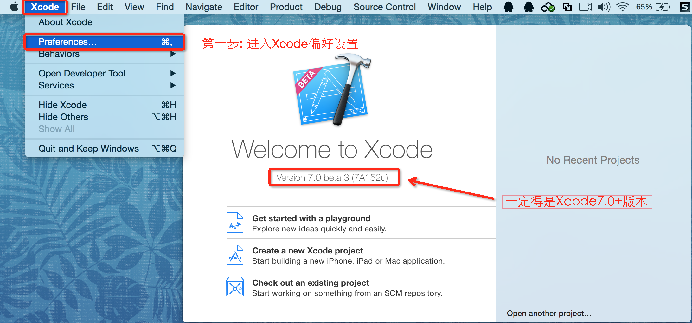
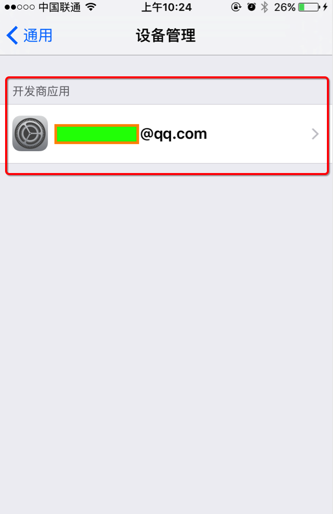

##	真机调试步骤:

#####	1.Xcode7.0下载

#####	2.进入Xcode偏好设置

#####	3.添加AppID

#####	4.调整部署版本

#####	5.运行报错提示

#####	6.Xcode自动解决问题

#####	7.成功生成

##		常见问题以及解决方案

####	1. The account XXX has no team with ID XXXX

####	解决方法：

####	2.  An App ID with identifier XXX is not avaliable. Please enter a different string

####	解决方法：

####	3. Could not launch XXX 

####	解决方法：

