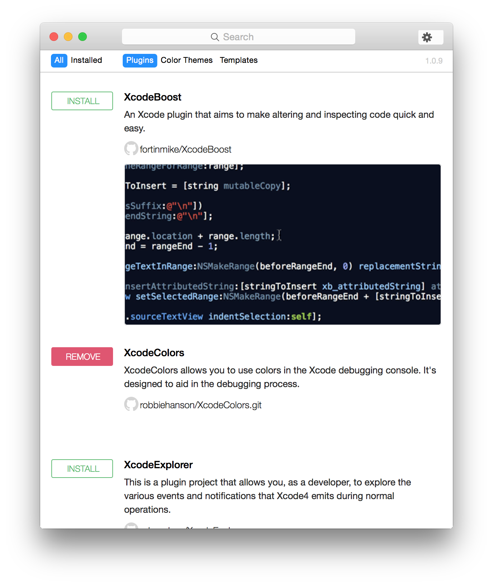
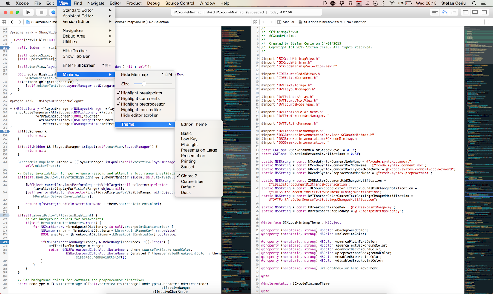

####	1.Alcatraz 一个能帮你管理Xcode插件丶模版及颜色配置的工具。它可以直接集成在Xcode的图形界面中,让你感觉就像在使用Xcode自带的功能一样。

##  [链接地址](https://github.com/alcatraz/Alcatraz)

####	2.VVDocumenter-Xcode  注释生成器

##  [链接地址](https://github.com/onevcat/VVDocumenter-Xcode)

####	3.KSImageNamed  使用的UIImage的imageNamed显示小面板显示可选图片 

##  [链接地址](https://github.com/ksuther/KSImageNamed-Xcode)

####	4.SCXcodeMiniMap  当前的窗口内创建一个代码迷你地图，并在屏幕上高亮提示 

##  [链接地址](https://github.com/stefanceriu/SCXcodeMiniMap)

####	5.FuzzyAutocomplete  代码自动补全 

##  [链接地址](https://github.com/FuzzyAutocomplete/FuzzyAutocompletePlugin)
