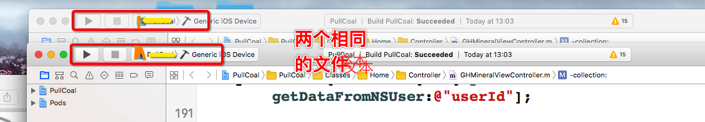
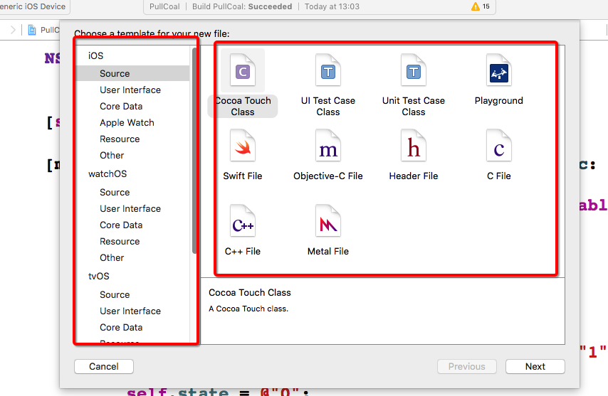
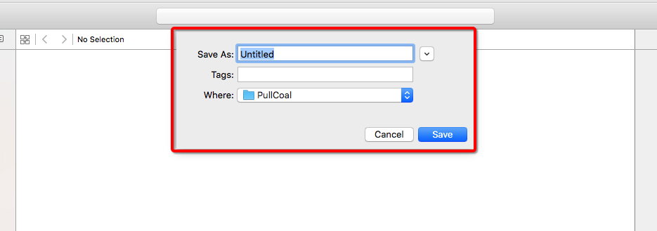
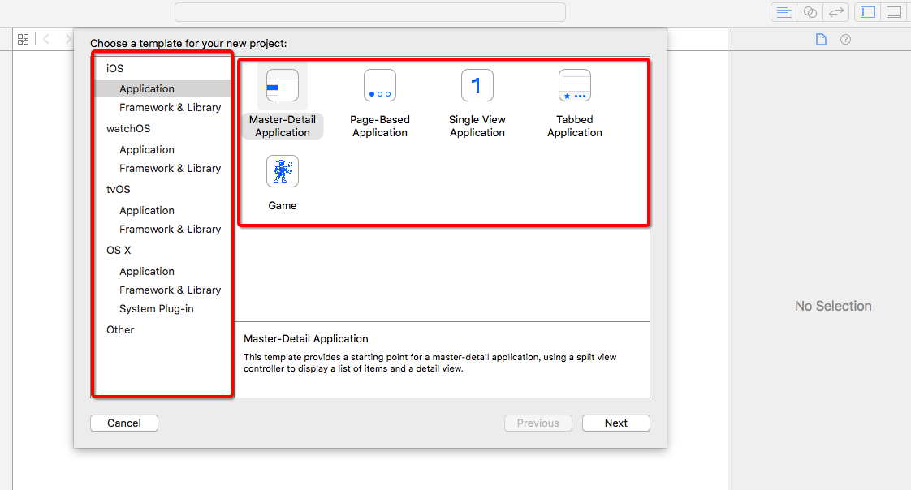
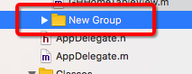
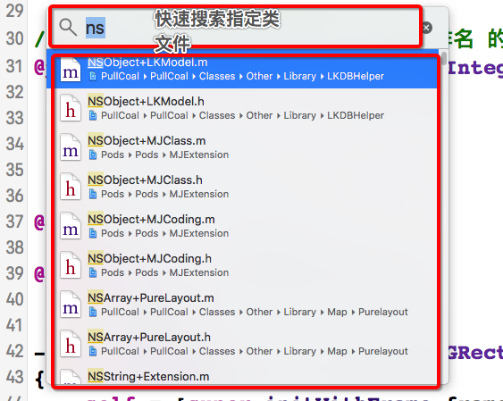
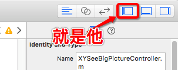
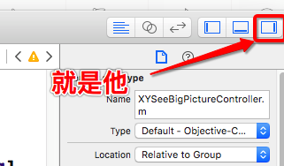

---
title: Xcode应用程序的快捷方式
date: 2016-08-31 11:12:57
tags:
---

##  Xcode相关：

###  打开Xcode偏好设置（Preferences）      `Command ＋ 逗号（,）`
###  隐藏Xcode  `Command ＋ H`
###  隐藏其他文件（非当前窗口显示的文件为其他文件，非鼠标光标所指文件） `Command ＋ Alt ＋ H`
###  退出Xcode `Command ＋ Q`

##  文件相关：
###  添加一个新桌面(New Tab)  `Command + T` 

###  添加一个新窗口((New Window)当前项目拷贝一份显示) `Shift + Command + T`
 
###  创建一个新文件(New File) `Command + N`

###  创建一个新项目(New Project) `Shift + Command + N`

###  创建一个新工程(New Workspace) `Ctrl + Command + N`

###  创建一个虚拟文件夹(New Group) `Ctrl + Alt + N`

###  快速打开一个选中的文件夹 `Command + O`
###  快速查找项目中的.h或.m文件 `Shift + Command + O`

###  显示/隐藏导航器面板 `Command + 0`

###  显示/隐藏实用工具面板 `Command + Option + 0`
