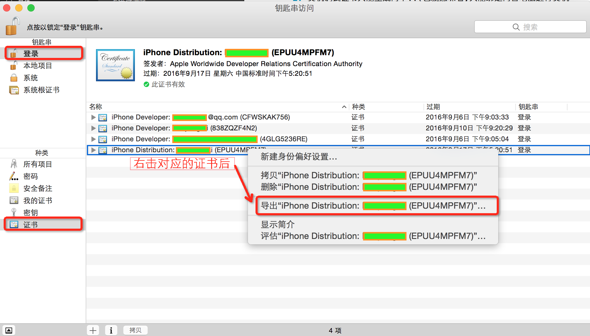
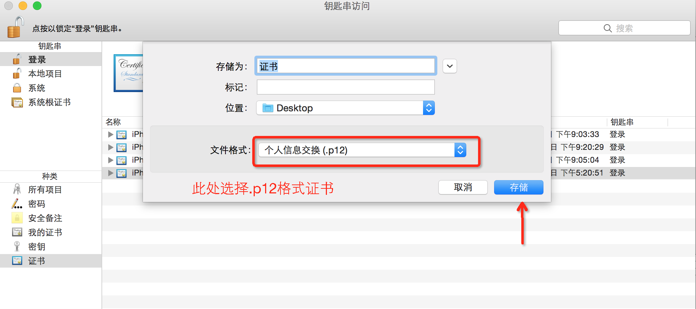
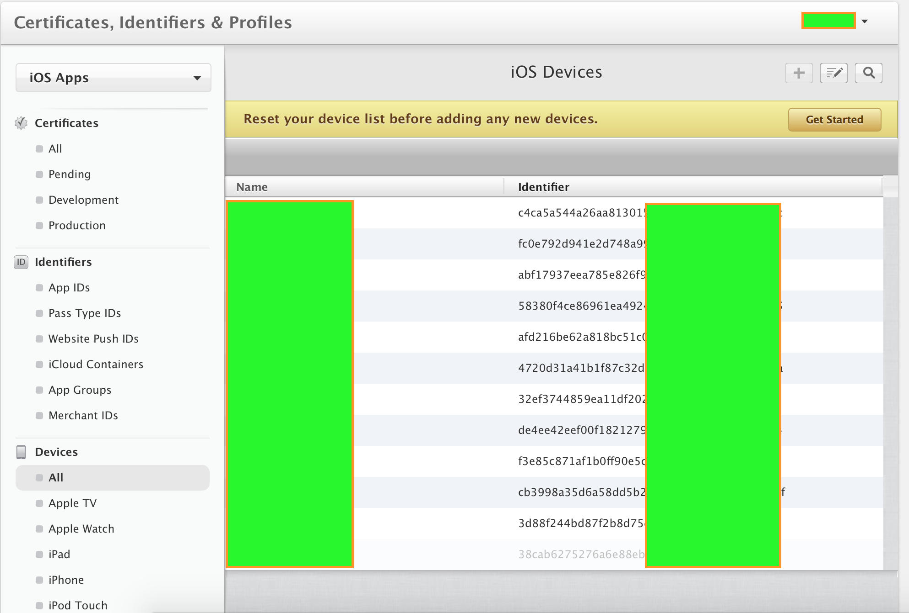
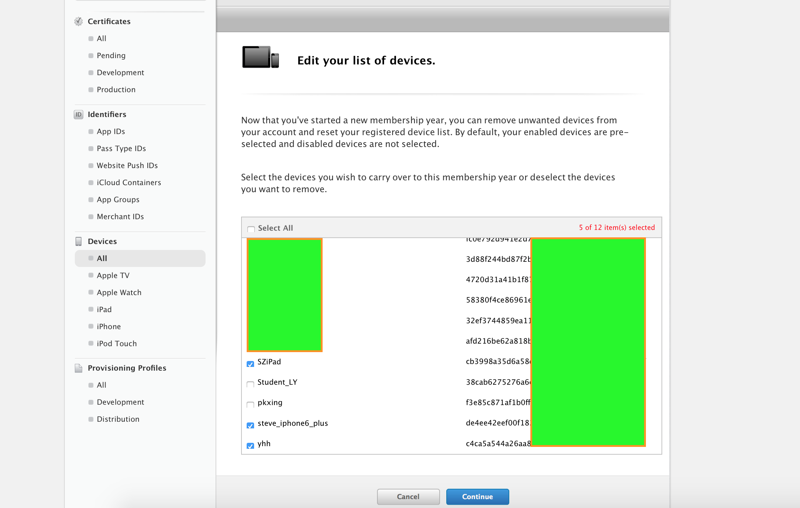
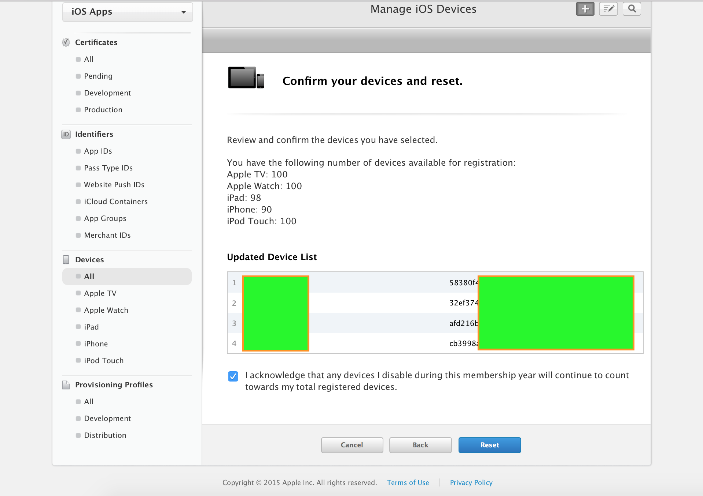
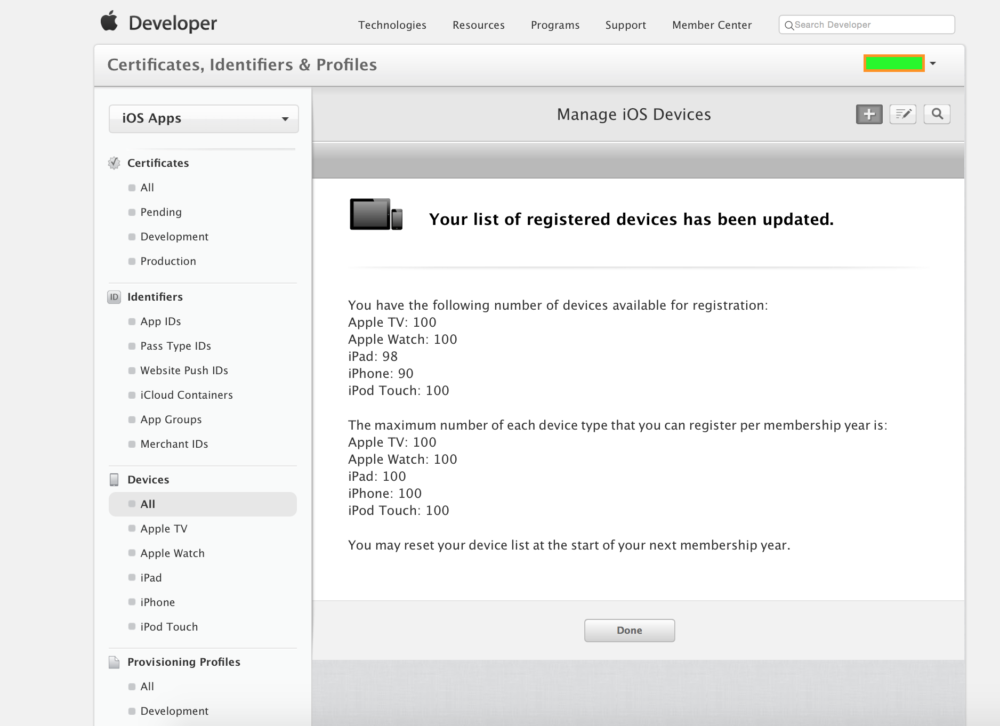
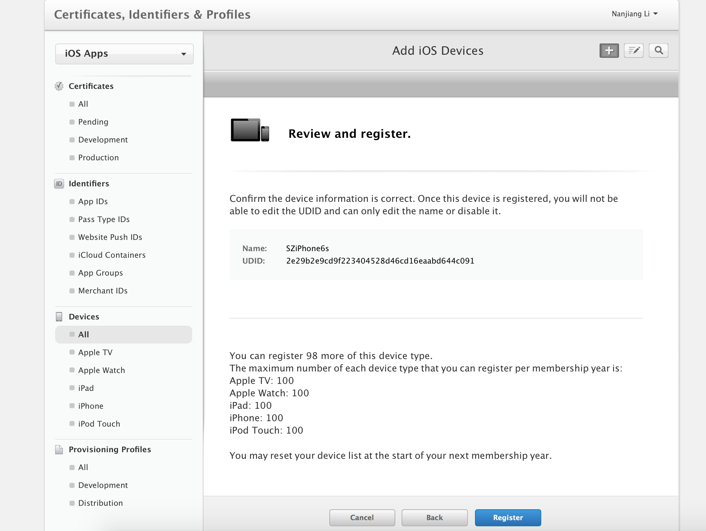
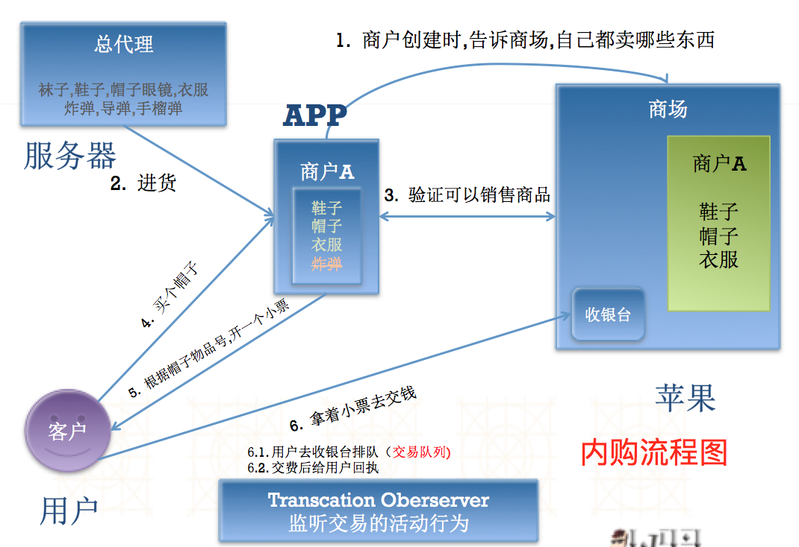

####	1. 什么是真机调试?
	简单理解就是将App项目运行到真机上进行测试

####	2.为什么要运行到真机上, 不是可以运行到模拟器上吗?(`APP发布之前一定要做真机调试！！！`)
	真机和模拟器环境的差异
    	内存环境,网络环境; 
    	传感器: 磁力计，陀螺仪，距离传感器等;
    	特定功能：拍照, 打电话，发短信，蓝牙等。
    	用户体验不一样
    

####	3. 怎样做真机调试?

Xcode7.0之前,并不是任何人,任何电脑,任何APP,任何真机设备都可以进行真机调试的
	1. 限制人
	
     	必须拥有Apple ID([https://appleid.apple.com])
     	加入开发者计划,升级为**开发者账号**([https://developer.apple.com])
 	2. 限制电脑
 	
     	配置与电脑关联的cer证书
         	需要使用需要真机调试的电脑,生成CSR文件
         	CSR文件: 证书签名请求文件
   	3. 限制App
   	
    	配置需要真机测试App的BundleID
         	区分不同APP,就是通过App的唯一标识: BundleID
 	4. 限制真机设备
 	
     	配置需要真机测试的真机UDID
         	苹果每台真机设备都拥有一个唯一标识:UDID
         	
Xcode7.0之后, 做真机调试, 非常简单 只需要拥有Apple ID即可, 不需要以上限制

####	4. 真机调试注意事项

1.以上步骤完成后,你会有两个文件:cer文件,MobileProvision文件,只需要双击安装即可.

	cer证书被添加到钥匙串中
	描述文件被安装到Xcode中
		资源库 -> MobileDevice -> Provisioning Profiles
	
2.必须保证cer证书和描述文件一致

	Xcode -> targets -> build setting -> code signing

3.创建一个APP,并确认BundleID与配置一致

	如果不一致, 修改XCode项目的BundleID, 与配置一致.

4.真机运行时, 如果发现真机设备无法选中, 查看项目最低部署版本是否过高, 大于真机设备的系统版本

	如果真机设备系统版本过高, 则无法选中真机进行运行

### 5. 备注补充
#####	开发者账号分类

个人账号(99$)==688
	
	功能:可以真机调试, 打包测试, 程序发布. 
	优点:申请速度快, 给钱就行, 1-3个工作日即可 
	缺点:
		1.iTunes查看到的是个人信息, 无法间接为公司做宣传 
		2.无法创建管理自己的开发团队
公司账号(99$)

	功能:可以真机调试, 打包测试, 程序发布. 
	优点:
		1.iTunes可以查看企业信息, 间接为公司做宣传 
		2.可以创建和管理自己的开发团队
	缺点:
		1.申请复杂,需要”邓白氏”认证
		2.申请周期比较长(连同”邓白氏编码”申请, 最好准备30天左右时间)

企业账号(299$)

	功能:可以真机调试, 打包测试
	优点:
		1.可以在企业内部随意安装到苹果设备,不需要经过AppStore审核
		2.可以创建和管理自己的开发团队
		3.版本更新迭代比较快, 不需要经过审核
	缺点:
		1.申请复杂,需要”邓白氏”认证
		2.申请周期比较长(连同”邓白氏编码”申请, 最好准备30天左右时间)
		3.不能使用此证书,将App发布到AppStore
	
### 6. 开发经验

1.尽量不要从网络渠道以及代申请的公司去申请”邓白氏编码”.
	
	花钱多, 而且申请下来的”邓白氏编码”不一定和苹果服务器数据库内一致, 最终不可用; 浪费时间和金钱
	最正确的做法: 直接和苹果客服MM联系, 她们会告诉你申请流程, 需要提交哪些材料
	客服电话: 400 670 1855
			
2.企业级账号使用场景

	App是针对某一特定人群制定使用.只在企业内部安装, 无需发布到AppStore供他人下载
			
3.真机调试证书`只能生成两个`!!

	也就意味着,只能绑定两台电脑进行真机调试
	注意:如果别人已经配置了两个,而且正在使用,不能随便把别人的证书删除;
	解决方案:
		此时只能使用从已经配置证书的电脑中,导出P12文件,进行共享;
		作   用: 让其他电脑设备不需要生成cer证书,也可以进行真机调试;
		
####	*步骤图解*

	

4.测试的真机设备UDID最多只能添加100次, 而不是100台
	
	也就是说, 如果你加够了100次之后, 即使删除之前的设备名额, 也无法继续添加
	苹果会在下一年, 给你一次删除设备的机会, 你可以删除一些设备, 来恢复一些名额.
	但是, 一旦你添加了设备后, 苹果则视为你自动放弃添加设备!!

####	*步骤图解*
	

5.真机调试最终需要的文件

	cer文件(或者p12文件)
	MobileProvision文件
		
6.XCode7真机调试

	只需要AppID,在Xcode7 -> preference -> Account 中添加即可
	然后直接真机调试时,会弹出一个框,提示缺少描述文件. 直接点击”Fix issue”选项,Xcode会自动请求苹果服务器生成对应的描述文件

==============

## 二. 打包测试

### 1. 什么是打包测试?

	就是指将项目打包成为.ipa的压缩包, 供指定设备安装测试.
		
### 2. 为什么要做打包测试?

	当进入到测试阶段, 需要专门的测试人员对APP进行测试, 此时需要将APP安装到测试人员的测试设备上, 此时最佳的方案, 就是直接将项目打包成为.ipa包, 供测试人员下载测试;
		
### 3. 怎样进行打包测试?
1.限制人
	
	必须拥有Apple ID([https://appleid.apple.com])
	加入开发者计划,升级为**开发者账号**([https://developer.apple.com])
		
2.限制电脑

	重新配置一个**打包测试**证书(Ad Hoc)
	需要使用需要打包测试的电脑,生成CSR文件
		CSR文件: 证书签名请求文件
3.限制App

	配置需要真机测试App的BundleID
		区分不同APP,就是通过App的唯一标识: BundleID
			
4.限制真机设备
		
	配置需要真机测试的真机UDID
		苹果每台真机设备都拥有一个唯一标识:UDID
			
5.根据2,3,4重新生成**打包测试**描述文件

6.分别安装cer证书和对应的描述文件

7.运行设备选择真机后 选择Product -> Archive

===================

## 三. 程序发布
### 1. 什么是程序发布?

	就是指将APP发布到AppStore, 供指定区域用户下载
		
### 2. 为什么要程序发布?
	赚钱.
		
### 3. 程序发布的步骤?
	
1.限制人

	必须拥有Apple ID([https://appleid.apple.com])
	加入开发者计划,升级为**开发者账号**([https://developer.apple.com])
		
2.限制电脑

	重新配置一个**发布**证书
	需要使用需要程序发布的电脑,生成CSR文件
		CSR文件: 证书签名请求文件
			
3.限制App

	配置需要真机测试App的BundleID
		区分不同APP,就是通过App的唯一标识: BundleID
			
4.根据2,3重新生成**发布**描述文件

	** 注意: 程序发布, 是发布到AppStore, 所以不会有限制设备一项**

5.在开发中心新建App, 并填写App相关的信息

	就比如我们下载别人的app,就会发现里面有预览图片, app版本,以及功能简介等信息, 那这些信息都是我们在这一步填写的
		
6.写好一个应用程序

	注意:必须要有程序图标,启动图片等,否则上传会失败
		
7.运行设备选择真机后 选择Product -> Archive

8.选择 submit 打包项目,上传构建版本

9.提交审核

=========================

## 4. 经验补充
1.常规审核周期

	审核周期2至20天不等, 而且他们碰到节假日还放假.

2.加急审核

	概念: 简单理解就是你联系苹果审核人员,跟他们说明理由,让他们优先给你们审核
	地址: [https://developer.apple.com/contact/app-store/?topic=expedite]

==========================

## 四. 内购和广告

### 1. 什么是内购?

	内购就是指,在APP内购买某些产品
	如果你在App中销售的商品,跟App有关(例如植物大战僵尸中的道具,需要开启关卡,拥有某种技能等等).那么,苹果规定,必须通过内购方式购买.
	内购分成: 3 : 7
		
### 2. 为什么做内购?

	开发者创收的一种模式: free + 内购
	某些业务必须使用内购
		
### 3. 内购的产品类型?
1.非消耗品(Nonconsumable)

	买了就一直有,不会消耗,例如开启关卡
	一般指的是在游戏中一次性购买并拥有永久访问权的物品或服务。非消耗品物品可以被用户再次下载，并且能够在用户的所有设备上使用

2.消耗品(Consumable)

	买了就用，用了就没
	专为支持可消耗的物品或服务设计的，消耗品购买不可被再次下载，根据其特点，消耗品不能在用户的设备之间跨设备使用，除非自定义服务在用户的账号之间共享这些信息

3.其他类型

	以下三种类别在iBooks中使用，目前iBooks不支持大陆市场
		免费订阅（Free subscriptions）
		自动续费订阅（Auto-renewing subscriptions）
		非自动续费订阅（Nonrenewing subscriptions）

4.内购的流程

*类似于商场购物流程, 参照下图*

5.内购演练

	在App管理中心,创建一个App,并填写App信息
		注意: 此处创建的App时,填写套装ID,时,必须选择可以内购的套装ID
			
	创建内购商品,并添加到App,指定此App,可以销售哪些商品
		注意: 创建内购商品的前提,是你已经填写了税务/银行信息,否则的话,无法创建
			
	添加用于测试内购的测试账号
	
	创建App项目,开始开发
		
#####	代码实现内购流程

-	(1) 从APP服务器请求数据列表, 并行苹果服务器请求可以销售的商品列表
				   
				[XMGDataTool getGoodsWithResult:^(NSArray *goods) {
        			NSArray *ids = [goods valueForKeyPath:@"goodID"];
        			// 请求哪些商品可以卖
			        NSSet *idSet = [NSSet setWithArray:ids];
			        SKProductsRequest *request = [[SKProductsRequest alloc] initWithProductIdentifiers:idSet];
			        request.delegate = self;
			        [request start];
			    }];
			
-	(2) 在代理方法中获取并显示可销售列表
				
				- (void)productsRequest:(SKProductsRequest *)request didReceiveResponse:(SKProductsResponse *)response
				{
				    self.products = response.products;
				}
			
-	(3) 用户购买商品, 并监听商品交易状态
			
				// 取出商品
			    SKProduct *product = self.products[indexPath.row];

			    // 购买商品
			    SKPayment *payMent = [SKPayment paymentWithProduct:product];

			    // 把凭证加入到队列, 等待用户付款
			    [[SKPaymentQueue defaultQueue] addPayment:payMent];

			    // 设置监听者, 监听整个交易状态
			    [[SKPaymentQueue defaultQueue] addTransactionObserver:self];
			    
-	(4) 实现监听交易状态方法
			 
			 	// 交易状态发生变化时调用
				- (void)paymentQueue:(SKPaymentQueue *)queue updatedTransactions:(NSArray<SKPaymentTransaction *> *)transactions
				{

    			[transactions enumerateObjectsUsingBlock:^(SKPaymentTransaction * _Nonnull obj, NSUInteger idx, BOOL * _Nonnull stop) 
    			{

        			//  SKPayment *payment , 小票 , 包含商品
        			//  SKPaymentTransactionState transactionState 交易状态
        		switch (obj.transactionState) {
            		case  SKPaymentTransactionStatePurchasing:
                		NSLog(@"正在付款");
                	break;

            		case  SKPaymentTransactionStatePurchased:
            			{
                			NSLog(@"付款结束");
                			[queue finishTransaction:obj];
                			break;
            			}
            		case  SKPaymentTransactionStateFailed:
            			{
               				NSLog(@"交易失败");
                			[queue finishTransaction:obj];
                			break;
            			}
            		case  SKPaymentTransactionStateRestored:
                		NSLog(@"恢复购买");
                		break;
            		case SKPaymentTransactionStateDeferred:
               			NSLog(@"推迟付款");
                		break;
                
            		default:
                		break;
                	}
               	   }];
             	}

### 4. 广告

	广告的作用?
		属于创收的一种方式, 你在App内展示广告,苹果会付费给你,分成从原来的4:6 到 3:7
		 
	如何展示广告
		导入框架: iAd.framework
		添加控件: ADBannerView 
		实现代理 ADBannerViewDelegate,优化用户体验

