##		1. 配置证书/描述文件/安装:
####	1. 确定哪台电脑可以进行App发布
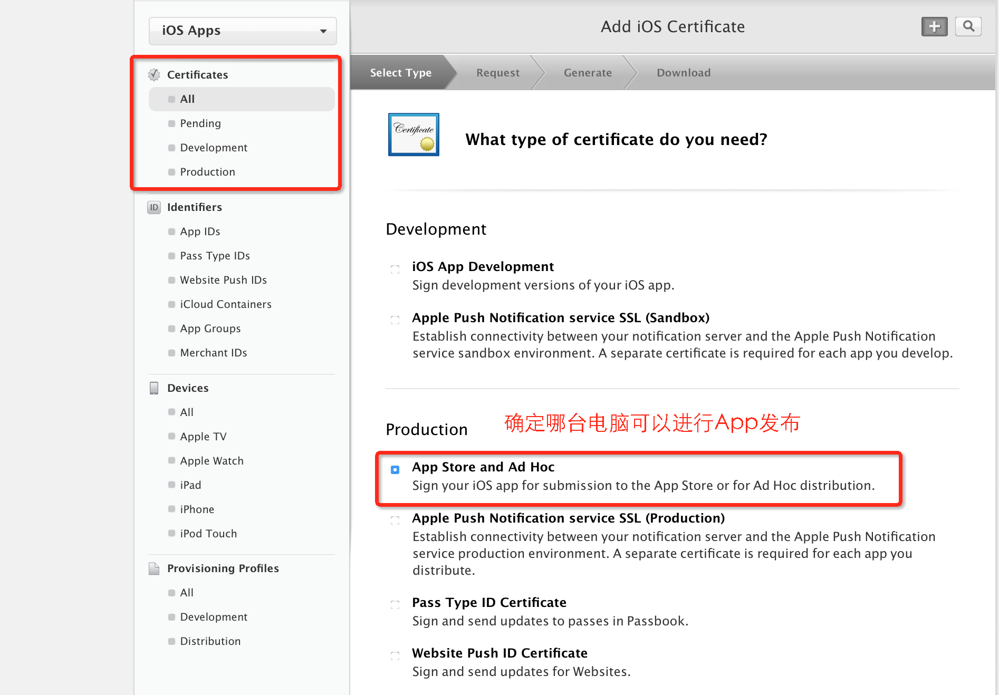
####	2. 确定哪个App可以进行发布
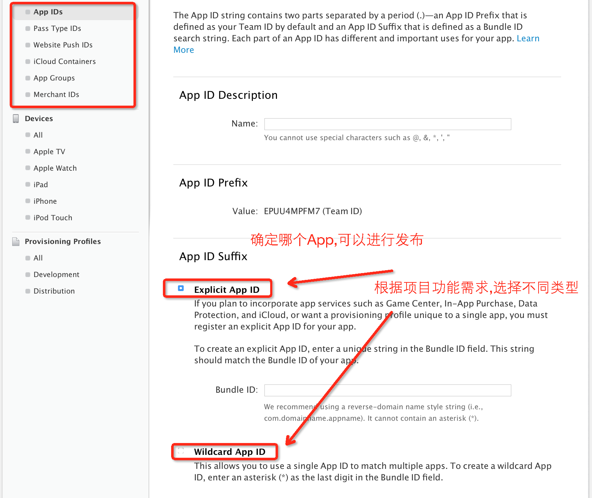
####	3. 根据证书+APP ID 生成描述文件
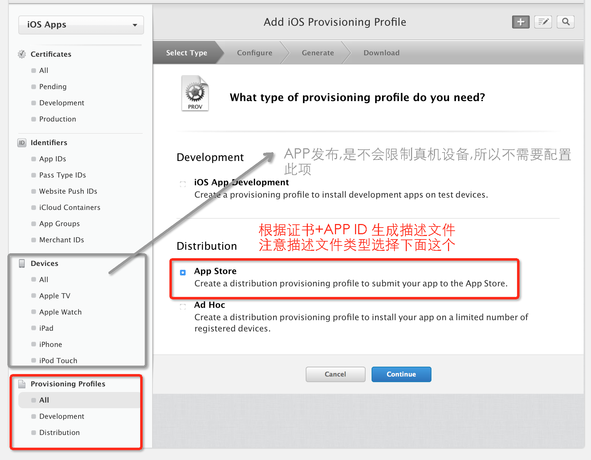

##		2. 在开发中心创建APP:

#### 	1.登录iTunes
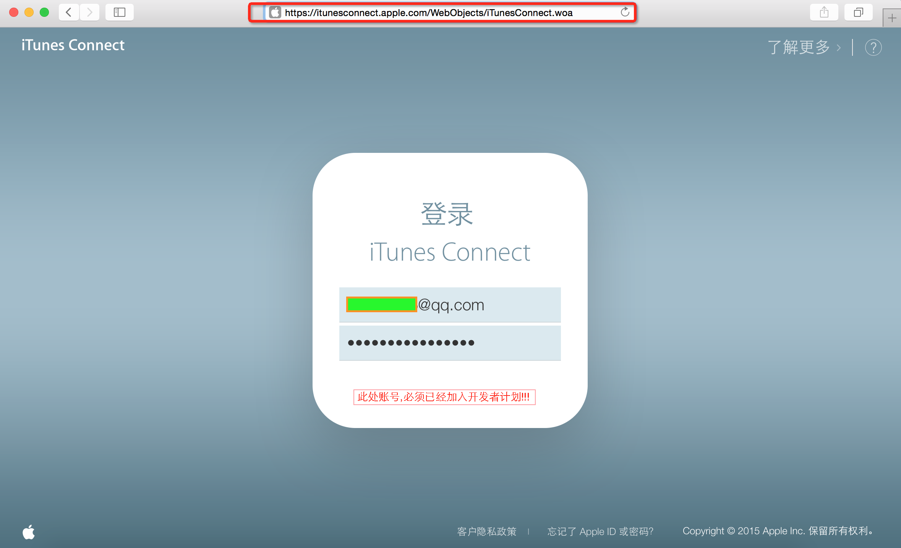
#### 	2.选择"我的APP"模块	

####	3.新建APP 	
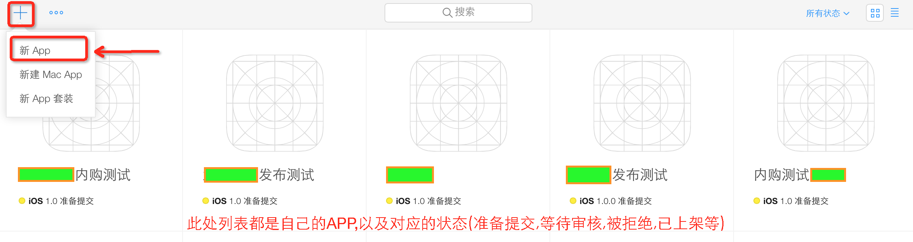
#### 	4.填写APP基本信息
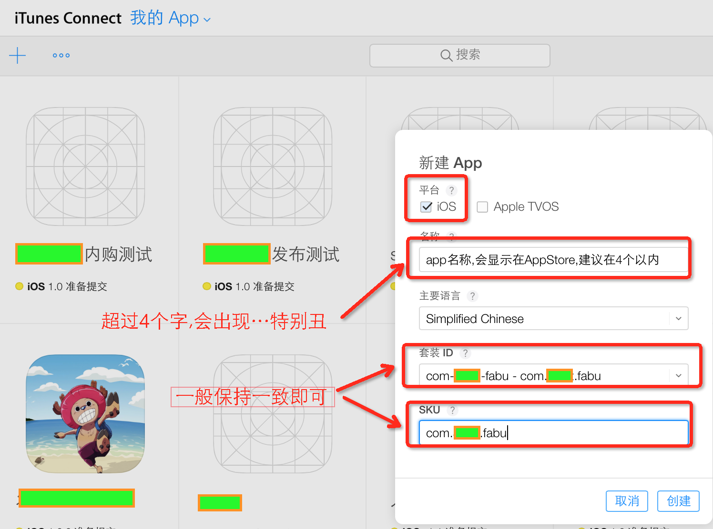
#### 	5.填写APP其他信息
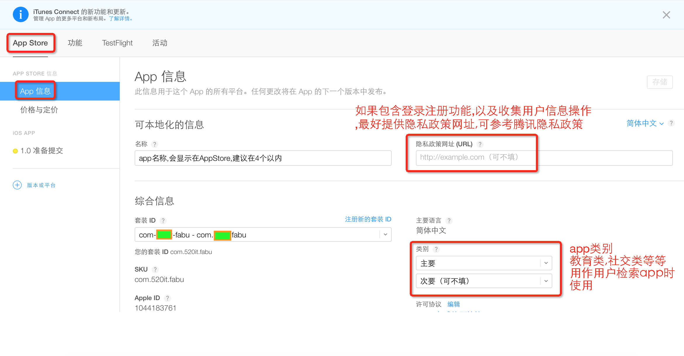
#### 	6.指定APP销售价格

##		3. 打包上传:
####	1
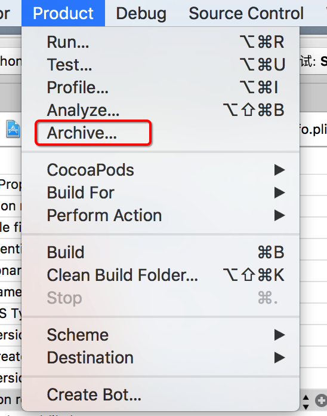
####	2
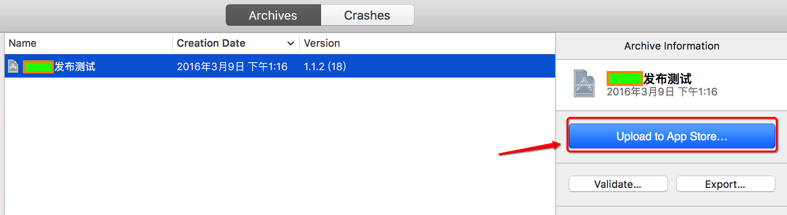
####	3
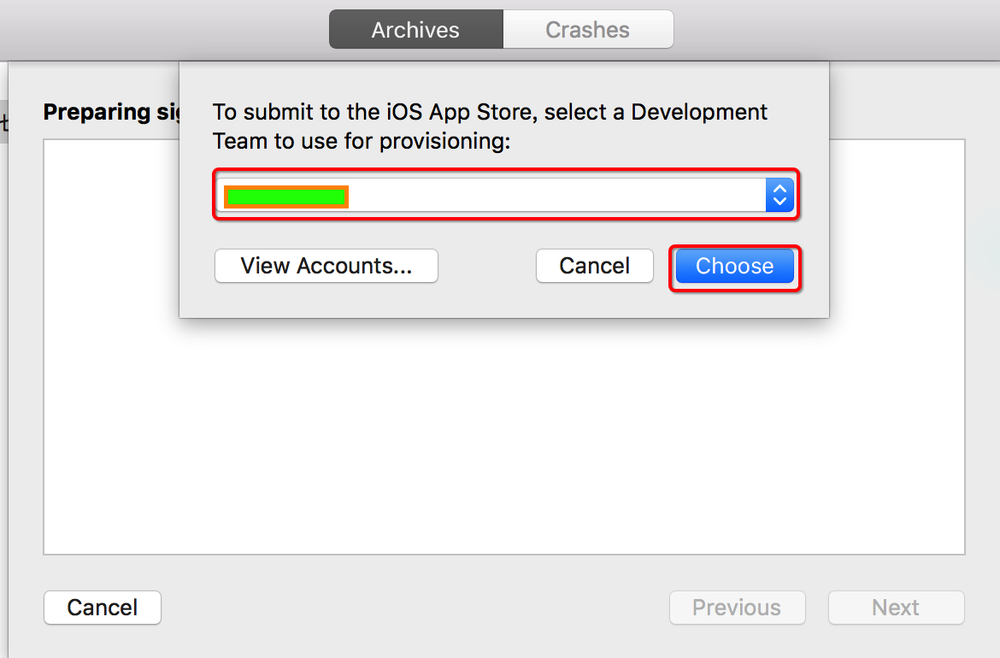
####	4
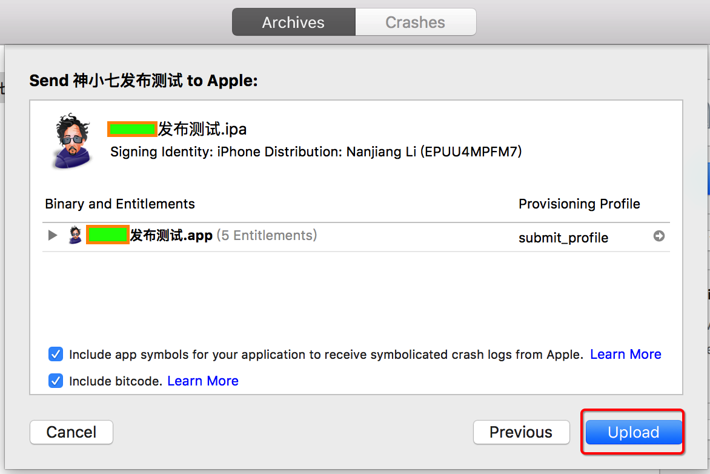
####	5
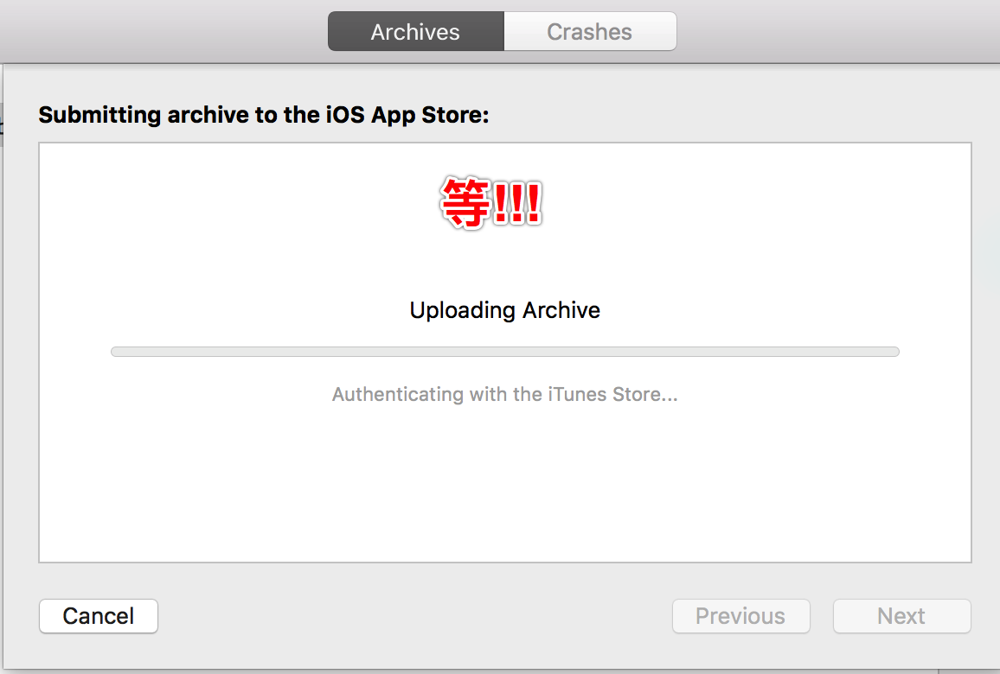
####	6
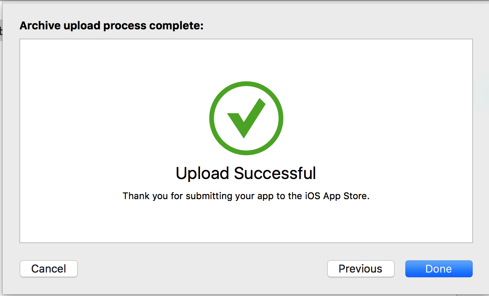
####	7
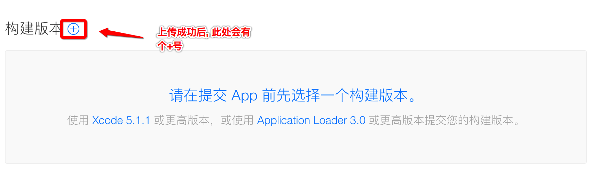
####	8
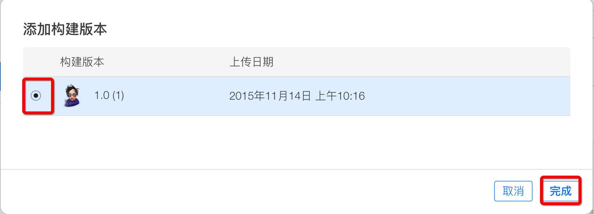
####	9
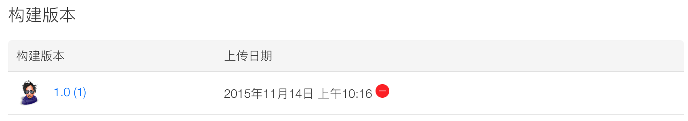
