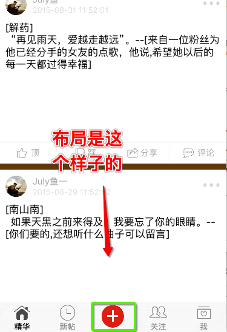

```
#import <UIKit/UIKit.h>

@interface XYTabBar : UITabBar

@end

#import "XYTabBar.h"

@interface XYTabBar ()

@property (nonatomic, weak) UIButton *pulsButton;
@property (nonatomic, strong) UIControl *previousClickedTabbatButton;

@end

@implementation XYTabBar

- (UIButton *)pulsButton
{
    if (_pulsButton == nil) {
        UIButton *button = [UIButton buttonWithType:UIButtonTypeCustom];
        [button setImage:[UIImage imageNamed:@"tabBar_publish_icon"] forState:UIControlStateNormal];
        [button setImage:[UIImage imageNamed:@"tabBar_publish_click_icon"] forState:UIControlStateHighlighted];
        [button sizeToFit];
        [self addSubview:button];
        
        _pulsButton = button;
    }
    return _pulsButton;
}

- (void)layoutSubviews
{
    [super layoutSubviews];
    
    NSInteger count = self.items.count + 1;
    
    CGFloat w = self.xy_width / count;
    CGFloat h = self.xy_height;
    CGFloat x = 0;
    
    int i = 0;
    for (UIControl *tabBarButton in self.subviews) {
        
        if (i == 0) {
            self.previousClickedTabbatButton = tabBarButton;
        }
        
        if ([tabBarButton isKindOfClass:NSClassFromString(@"UITabBarButton")]) {
            if (i == 2) {
                i += 1;
            }
            
            x = i * w;
            tabBarButton.frame = CGRectMake(x, 0, w, h);
            
            i ++;
            
            //  添加监听
            [tabBarButton addTarget:self action:@selector(tabBarButtonClick:) forControlEvents:UIControlEventTouchUpInside];
        }
    }
    
    // 发布按钮的位置
    self.pulsButton.center = CGPointMake(self.xy_width * 0.5, self.xy_height * 0.5);
    
}

#pragma mark - 监听
/**
 *  监听重复点击
 */
- (void)tabBarButtonClick:(UIControl *)tabBarButton
{
    if (self.previousClickedTabbatButton == tabBarButton) {
        [[NSNotificationCenter defaultCenter] postNotificationName:XYTabBarButtonDidClickRepeatNotification object:nil];
    }
    
    self.previousClickedTabbatButton = tabBarButton;
}

@end

```
