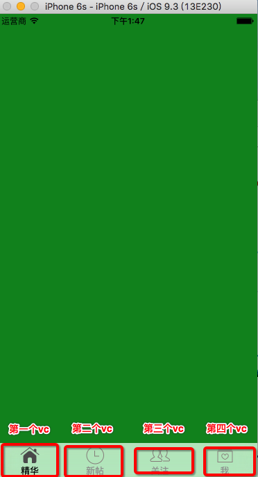

```
#import <UIKit/UIKit.h>

@interface XYTabBarController : UITabBarController

@end
#import "XYTabBarController.h"
#import "XYEssesionViewController.h"
#import "XYNewViewController.h"
#import "XYFriendTrendsViewController.h"
#import "XYMeTableViewController.h"
#import "XYNavigationController.h"
#import "XYTabBar.h"

@interface XYTabBarController ()

@end

@implementation XYTabBarController

// 设置tabbarItem的相关属性
+ (void)load
{
    UITabBarItem *tabBarItem = [UITabBarItem appearanceWhenContainedIn:self, nil];
    // 正常
    NSMutableDictionary *norAttres = [NSMutableDictionary dictionary];
    norAttres[NSFontAttributeName] = [UIFont boldSystemFontOfSize:13];
    [tabBarItem setTitleTextAttributes:norAttres forState:UIControlStateNormal];
    
    // 选中
    NSMutableDictionary *selAttres = [NSMutableDictionary dictionary];
    selAttres[NSForegroundColorAttributeName] = [UIColor blackColor];
    [tabBarItem setTitleTextAttributes:selAttres forState:UIControlStateSelected];
}

- (void)viewDidLoad {
    [super viewDidLoad];

    // 添加所有控制器
    [self setupAllChildVc];
    
    // 自定义tabbar
    XYTabBar *tabBar = [[XYTabBar alloc] init];
    [self setValue:tabBar forKeyPath:@"tabBar"];
}

- (void)setupAllChildVc
{
    //精华
    [self setupOneChildVc:[[XYEssesionViewController alloc] init] image:@"tabBar_essence_icon" selImage:@"tabBar_essence_click_icon" title:@"精华"];
    //新帖
    [self setupOneChildVc:[[XYNewViewController alloc] init] image:@"tabBar_new_icon" selImage:@"tabBar_new_click_icon" title:@"新帖"];
    //关注
    [self setupOneChildVc:[[XYFriendTrendsViewController alloc] init] image:@"tabBar_friendTrends_icon" selImage:@"tabBar_friendTrends_click_icon" title:@"关注"];
    //我
    UIStoryboard *storyboard = [UIStoryboard storyboardWithName:NSStringFromClass([XYMeTableViewController class]) bundle:nil];
    [self setupOneChildVc:[storyboard instantiateInitialViewController] image:@"tabBar_me_icon" selImage:@"tabBar_me_click_icon" title:@"我"];
}

- (void)setupOneChildVc:(UIViewController *)vc image:(NSString *)image selImage:(NSString *)selImage title:(NSString *)title
{
    vc.tabBarItem.title = title;
    vc.tabBarItem.image = [UIImage imageNamed:image];
    vc.tabBarItem.selectedImage = [UIImage imageNamed:selImage];
    XYNavigationController *nav = [[XYNavigationController alloc] initWithRootViewController:vc];
    [self addChildViewController:nav];
}
```
