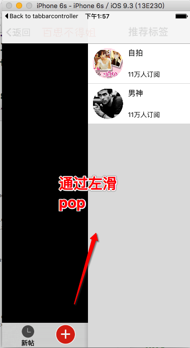

`左滑执行pop`

```
#import <UIKit/UIKit.h>

@interface XYNavigationController : UINavigationController

@end

#import "XYNavigationController.h"

@interface XYNavigationController ()<UIGestureRecognizerDelegate>

@end

@implementation XYNavigationController


// 设置navbar的属性
+ (void)load
{
    UINavigationBar *navBar = [UINavigationBar appearanceWhenContainedIn:self, nil];
    
    // 正常
    NSMutableDictionary *attrs = [NSMutableDictionary dictionary];
    attrs[NSFontAttributeName] = [UIFont boldSystemFontOfSize:20];
    [navBar setTitleTextAttributes:attrs];
    
    // 背景图片
    [navBar setBackgroundImage:[UIImage imageNamed:@"navigationbarBackgroundWhite"] forBarMetrics:UIBarMetricsDefault];
}

- (void)viewDidLoad {
    [super viewDidLoad];

    UIPanGestureRecognizer *pan = [[UIPanGestureRecognizer alloc] initWithTarget:self.interactivePopGestureRecognizer.delegate action:@selector(handleNavigationTransition:)];
    pan.delegate = self;
    
    [self.view addGestureRecognizer:pan];
    
    self.interactivePopGestureRecognizer.enabled = NO;
    
//    XYLog(@"%@",self.interactivePopGestureRecognizer);
}

- (void)didReceiveMemoryWarning {
    [super didReceiveMemoryWarning];

}

- (void)pushViewController:(UIViewController *)viewController animated:(BOOL)animated
{
    
    if (self.childViewControllers.count > 0) {
        //  隐藏底部工具栏
        viewController.hidesBottomBarWhenPushed = YES;
        
        viewController.navigationItem.leftBarButtonItem = [UIBarButtonItem itemWithImage:[UIImage imageNamed:@"navigationButtonReturn"] heghImage:[UIImage imageNamed:@"navigationButtonReturnClick"] target:self action:@selector(back) title:@"返回"];
    }
    
    [super pushViewController:viewController animated:animated];
}

- (void)back
{
    [self popViewControllerAnimated:YES];
}

- (BOOL)gestureRecognizer:(UIGestureRecognizer *)gestureRecognizer shouldReceiveTouch:(UITouch *)touch
{
    return self.childViewControllers.count > 1;
}

@end
```
