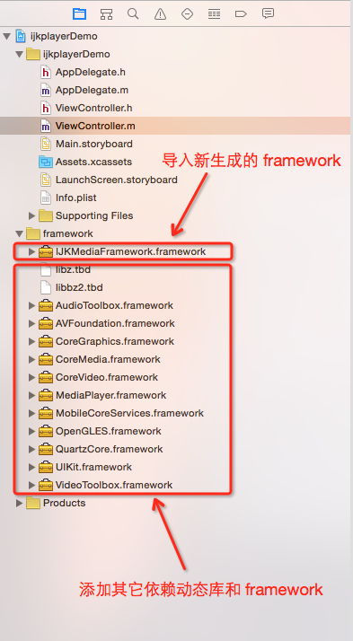

###	方法一：
####	使用IJKMediaFramework.framework(将IJKMediaFramework.framework导入到工程,做直播用这个)
-	添加依赖库



####	*示例代码*（以前项目中用到的地方，捡需要的东西拿）

```
#import <UIKit/UIKit.h>

@interface PlayViewController : UIViewController

@property (nonatomic, strong)NSURL * liveUrl;
@property (nonatomic, strong)NSString * imageUrl;

@end

#import "PlayViewController.h"
#import "UIImageView+WebCache.h"
#import <IJKMediaFramework/IJKMediaFramework.h>
#define XJScreenH [UIScreen mainScreen].bounds.size.height
#define XJScreenW [UIScreen mainScreen].bounds.size.width

@interface PlayViewController ()

//背景图片
@property (nonatomic, strong)UIImageView *backgroundIamgeView;

//用于播放直播视频的控制器
@property (atomic, retain) id <IJKMediaPlayback> player;

@end

@implementation PlayViewController

- (void)viewDidLoad {
    [super viewDidLoad];
    
    self.view.backgroundColor = [UIColor whiteColor];
    
    //直播试图
    [self goPlaying];
    
    // 开启通知
    [self installMovieNotificationObservers];
    
    [self loadUI];
   
}

- (void)goPlaying{
    
    self.player = [[IJKFFMoviePlayerController alloc]initWithContentURL:self.liveUrl withOptions:nil];
    
    //获取到直播试图
    UIView *playerView = [self.player view];
    playerView.frame = self.view.bounds;
    
    [self.view addSubview:playerView];
    
    //这一步必须有，否则不能播放，准备完毕自动开始播放
    [self.player prepareToPlay];
    
}

- (void)loadUI
{
    //背景图片
    self.backgroundIamgeView = [[UIImageView alloc] initWithFrame:self.view.bounds];
    [self.backgroundIamgeView sd_setImageWithURL:[NSURL URLWithString: _imageUrl] placeholderImage:[UIImage imageNamed:@"LaunchImage-700"]];
    
    [self.view addSubview:self.backgroundIamgeView];

    //背景图片的毛玻璃效果
    UIVisualEffect *blurEffect = [UIBlurEffect effectWithStyle:UIBlurEffectStyleLight];
    UIVisualEffectView *visualEffectView = [[UIVisualEffectView alloc] initWithEffect:blurEffect];
    visualEffectView.frame = self.backgroundIamgeView.bounds;
    [self.backgroundIamgeView addSubview:visualEffectView];

    // 返回
    UIButton * backBtn = [UIButton buttonWithType:UIButtonTypeCustom];
    backBtn.frame = CGRectMake(10, 24, 33, 33);
    [backBtn setImage:[UIImage imageNamed:@"show_image_back_icon"] forState:UIControlStateNormal];
    [backBtn addTarget:self action:@selector(goBack) forControlEvents:UIControlEventTouchUpInside];
    backBtn.layer.shadowColor = [UIColor blackColor].CGColor;
    backBtn.layer.shadowOffset = CGSizeMake(0, 0);
    backBtn.layer.shadowOpacity = 0.5;
    backBtn.layer.shadowRadius = 1;
    [self.view addSubview:backBtn];
    
    // 暂停
    UIButton * playBtn = [UIButton buttonWithType:UIButtonTypeCustom];
    playBtn.frame = CGRectMake(XJScreenW - 43, 24, 33, 33);
    
    
    [playBtn setImage:[UIImage imageNamed:@"playButtonPause"] forState:(UIControlStateNormal)];
    [playBtn setImage:[UIImage imageNamed:@"playButtonPlay"] forState:(UIControlStateSelected)];
   
    [playBtn addTarget:self action:@selector(play_btn:) forControlEvents:(UIControlEventTouchUpInside)];
    playBtn.layer.shadowColor = [UIColor blackColor].CGColor;
    playBtn.layer.shadowOffset = CGSizeMake(0, 0);
    playBtn.layer.shadowOpacity = 0.5;
    playBtn.layer.shadowRadius = 1;
    [self.view addSubview:playBtn];
    
}

// 返回
- (void)goBack
{
    //停播
    [self.player shutdown];
    
    [self dismissViewControllerAnimated:YES completion:nil];
    
}

// 暂停开始
- (void)play_btn:(UIButton *)sender {
    
    sender.selected = !sender.selected;
    if (![self.player isPlaying]) {
        // 播放
        [self.player play];
    }else{
        // 暂停
        [self.player pause];
    }
}


/*
 
 IJKMPMoviePlayerLoadStateDidChangeNotification
 IJKMPMoviePlayerPlaybackDidFinishNotification
 IJKMPMediaPlaybackIsPreparedToPlayDidChangeNotification
 IJKMPMoviePlayerPlaybackStateDidChangeNotification
 */

#pragma mark 通知

- (void)installMovieNotificationObservers{
    
    //监听播放状态，当播放状态改变时将北京图片设为透明
    [[NSNotificationCenter defaultCenter] addObserver:self selector:@selector(moviePlayBackStateDidChange:) name:IJKMPMoviePlayerPlaybackStateDidChangeNotification object:_player];
    
}

- (void)removeMovieNotificationObservers {
    
    [[NSNotificationCenter defaultCenter] removeObserver:self name:IJKMPMoviePlayerPlaybackStateDidChangeNotification object:_player];
}

- (void)moviePlayBackStateDidChange:(NSNotification*)notification {
    
    self.backgroundIamgeView.hidden = YES;
    
}
- (void)dealloc{
    
    [self removeMovieNotificationObservers];
    
}

@end
```

###	方法二：

####	使用第三方(KRVideoPlayer)
[github链接](https://github.com/36Kr-Mobile/KRVideoPlayer)

####	pod "KRVideoPlayer"

```
target 'xxxxx' do
pod "KRVideoPlayer"
end
```
####	*示例代码*（以前项目中用到的地方，捡需要的东西拿，看不懂请点击右上角）

```
#import "XYTopicVideoView.h"
#import <UIImageView+WebCache.h>
#import "XYTopicModel.h"
#import "XYSeeBigPictureController.h"

#import <KRVideoPlayerController.h>

@interface XYTopicVideoView ()

@property (weak, nonatomic) IBOutlet UIImageView *imageView;

@property (weak, nonatomic) IBOutlet UIImageView *placeholderView;
@property (weak, nonatomic) IBOutlet UILabel *playcountLabel;
@property (weak, nonatomic) IBOutlet UILabel *videotimeLabel;

@property (nonatomic, strong) KRVideoPlayerController *videoController;

@end

@implementation XYTopicVideoView

- (void)awakeFromNib
{
    self.autoresizingMask = UIViewAutoresizingNone;
    
    //  允许图片交互
    self.imageView.userInteractionEnabled = YES;
    //  给图片添加点击手势
    [self.imageView addGestureRecognizer:[[UITapGestureRecognizer alloc] initWithTarget:self action:@selector(seeBigPicture)]];
}

- (void)seeBigPicture
{
    XYSeeBigPictureController *seeBigPicture = [[XYSeeBigPictureController alloc] init];
    seeBigPicture.topic = self.topic;
    [self.window.rootViewController presentViewController:seeBigPicture animated:YES completion:nil];
}
- (void)setTopic:(XYTopicModel *)topic
{
    _topic = topic;
    
    //  显示占位图
    self.placeholderView.hidden = NO;
    [self.imageView sd_setImageWithURL:[NSURL URLWithString:topic.image1] placeholderImage:nil completed:^(UIImage *image, NSError *error, SDImageCacheType cacheType, NSURL *imageURL) {
        if (!image) return;  //  图片下载不成功
        //  隐藏占位图
        self.placeholderView.hidden = YES;

    }];
}

- (IBAction)play {
    NSURL *videoURL = [NSURL URLWithString:self.topic.videouri];
    [self playVideoWithURL:videoURL];
}

- (void)playVideoWithURL:(NSURL *)url
{
    if (!self.videoController) {
        
        self.videoController = [[KRVideoPlayerController alloc] initWithFrame:[UIScreen mainScreen].bounds];

        __weak typeof(self)weakSelf = self;
        
        [self.videoController setDimissCompleteBlock:^{
            weakSelf.videoController = nil;
        }];
        [self.videoController showInWindow];
    }
    self.videoController.contentURL = url;
}

- (void)layoutSubviews
{
    [super layoutSubviews];
    
    self.videoController.frame = self.imageView.frame;
    
}
```