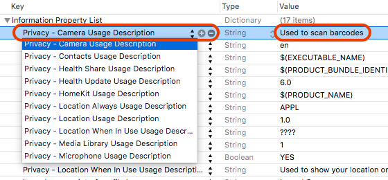
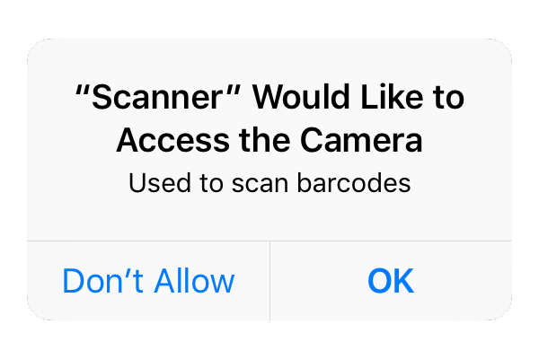

layout: ios10.0
title: 配置获取隐私数据权限声明
date: 2016-09-19 16:35:27
tags:
---
####  iOS 10的一大变化是更强的隐私数据保护。在文档中是这么描述的：

You must statically declare your app’s intended use of protected data classes by including the appropriate purpose string keys in your Info.plist file.

简单的说访问用户数据都需要现在`Info.plist`中声明，否则会`crash`。
这些用户数据包括：

Contacts, Calendar, Reminders, Photos, Bluetooth Sharing, Microphone, Camera, Location, Health, HomeKit, Media Library, Motion, CallKit, Speech Recognition, SiriKit, TV Provider.

10之前只需要获取位置时配置，现在更严格了，比如需要调用相册访问权限，也需要在Info.plist中配置privacy。
好在这些key的名字在Xcode 8中已经有了自动补全。添加一个属性，输入Privacy后就会出现自动提示:

	后面填的string会在弹出用户允许时展示在描述里。如果描述空着提交AppStore时会拒绝。
	
